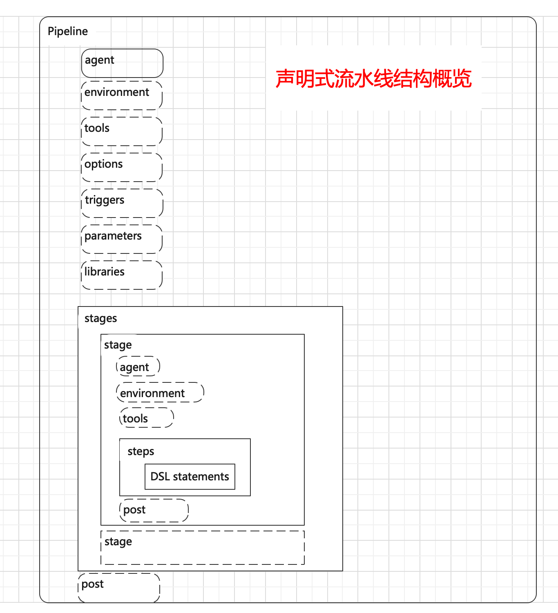

# jenkins知识图谱
#### 声明式流水线结构概览及解释

Pipeline  声明式流水线标志符  
agent  指定流水线或阶段在那个节点运行，共7中配置 
agent ang  
agent none  
agent {lable <label>}  
agent {docker <image>}  
agent {docker <elements>}  
agent {dockerfile true}  
agent {dockerfile <elements>}  

environment 指定流水线或阶段的环境变量，可选指令  
tools 指定哪些工具需要在流水线节点上安装  
options 指定流水线的一些属性和值  
triggers 指定使用什么类型的触发器来启动你的流水线构建  
cron  
upstream  
githubPush  
pollSCM  
parameters 为流水线指定项目参数  
booleanParam  
choice  
file  
text  
password  
run  
string  
