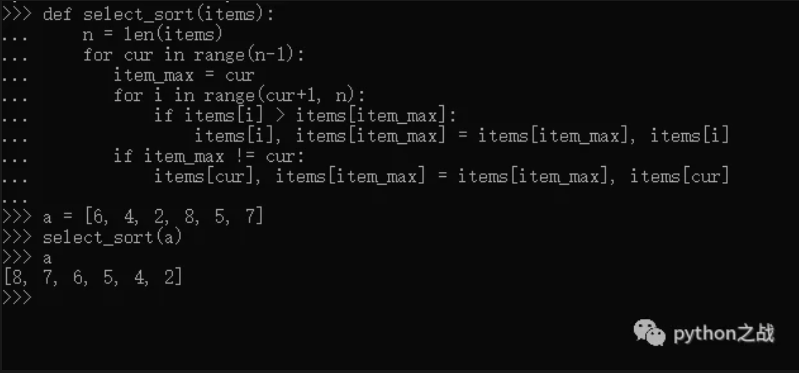

# python实现选择排序算法
选择排序，简单而直观，其原理是把序列中的最小值或者最大值找出来放在起始位置，然后再从剩下的序列中找出极值放到起始位置之后，
以此类推最后就完成排序。<br>
完成这个过程大致思想：首先需要一个记录器，记录排序排到第几个位置了，然后在剩余的序列中找到极值下标，
最后将记录器位置和极值位置元素交换，完成本次选择排序。<br>
用python实现比较简单：<br>
```
def select_sort(items):
    n = len(items)
    for cur in range(n-1):
       item_max = cur
       for i in range(cur+1, n):
           if items[i] > items[item_max]:
               items[i], items[item_max] = items[item_max], items[i]
       if item_max != cur:
           items[cur], items[item_max] = items[item_max], items[cur]
```

##### 关于选择排序的时间复杂度：
选择排序的交换操作介于 0 和 (n - 1） 次之间。选择排序的比较操作为 n (n - 1） / 2 次之间。
选择排序的赋值操作介于 0 和 3 (n - 1） 次之间。<br>
比较次数O(n^2），比较次数与关键字的初始状态无关，总的比较次数N=(n-1）+(n-2）+...+1=n*(n-1）/2。交换次数O(n），
最好情况是，已经有序，交换0次；最坏情况交换n-1次，逆序交换n/2次。交换次数比冒泡排序少多了，
由于交换所需CPU时间比比较所需的CPU时间多，n值较小时，选择排序比冒泡排序快。<br>
