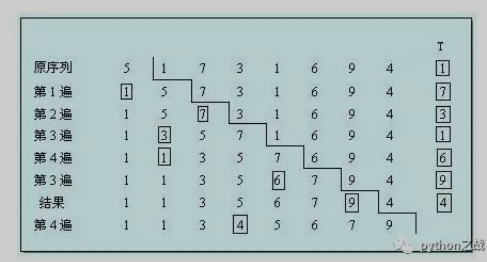

# python实现插入排序算法
插入排序，其原理是通过构建一个初始的有序序列，然后从无需序列中抽取元素，插入到有序序列的相对排序位置，
就像将一堆编号混乱的书，一本一本的放到书架上，找到上下编号之间的位置插入，最后完成整理。<br>
python实现插入排序并不难，从第二个位置开始遍历，与它前面的元素相比较，如果比前面元素小就交换位置，实现如下：<br>
```
def insert_sort(items):
    for i in range(1, len(items)):
        # 从第i个元素开始向前比较，如果小于前一个元素，交换位置
        for j in range(i, 0, -1):
            if items[j] < items[j-1]:
                items[j], items[j-1] = items[j-1], items[j]
```

插入排序的可应用于这样的场景：需要合并两个有序序列，并且合并后的序列依旧有序，此时插入排序可以排上用场。<br>
如果目标是把n个元素的序列升序排列，那么采用插入排序存在最好情况和最坏情况。
最好情况就是，序列已经是升序排列了，在这种情况下，需要进行的比较操作需（n-1）次即可。<br>
最坏情况就是，序列是降序排列，那么此时需要进行的比较共有n(n-1)/2次。插入排序的赋值操作是比较操作的次数加上 (n-1）次。
平均来说插入排序算法的时间复杂度为O(n^2）。因而，插入排序不适合对于数据量比较大的排序应用<br>
但是，如果需要排序的数据量很小，例如，量级小于千，那么插入排序还是一个不错的选择。<br>