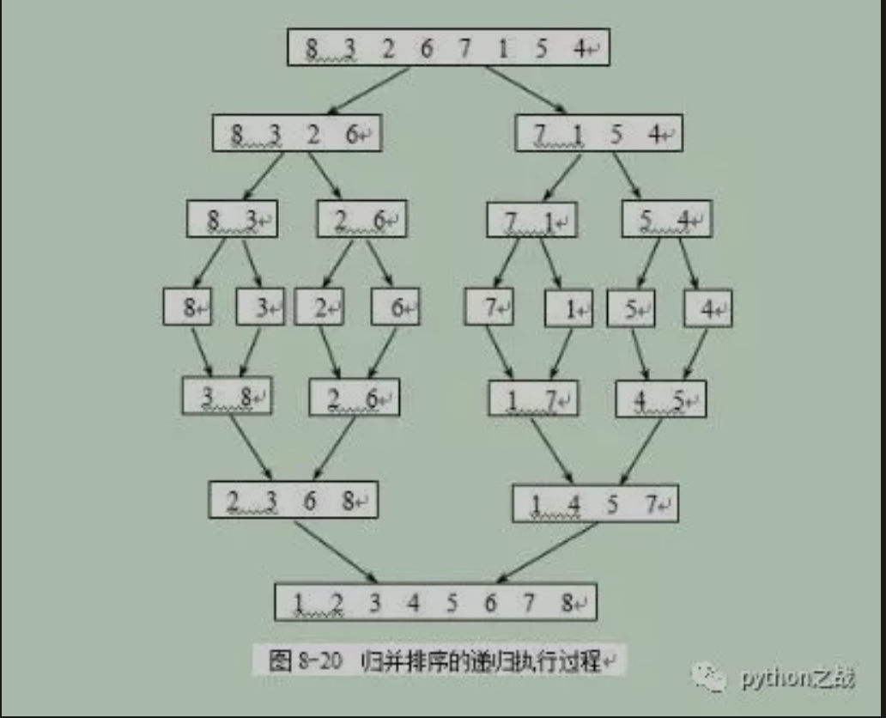

# python实现快速排序
快速排序，通过一趟排序将要排序的数据分割成独立的两部分，其中一部分的所有数据都比另外一部分的所有数据都要小，
然后再按此方法对这两部分数据分别进行快速排序，整个排序过程可以递归进行，以此达到整个数据变成有序序列。<br>
其原理是：从序列中找出一个基准元素，然后大于该元素的放到一边，小于该元素的放到另一边形成分区；
然后在分别冲大小分区中再找基准再分别分出相对大小分区，这样递归的完成快速排序。<br>
##### python实现如下：
```
def quick_sort(data):    
    """快速排序"""    
    if len(data) >= 2:  # 递归入口及出口        
        mid = data[len(data)//2]  # 选取基准值，也可以选取第一个或最后一个元素        
        left, right = [], []  # 定义基准值左右两侧的列表        
        data.remove(mid)  # 从原始数组中移除基准值        
        for num in data:            
            if num >= mid:                
                right.append(num)            
            else:                
                left.append(num)        
        return quick_sort(left) + [mid] + quick_sort(right)    
    else:        
        return data
```
##### 其他的一些实现：
```
def quick_sort(alist, start, end):
    """快速排序"""

    # 递归的退出条件
    if start >= end:
        return

    # 设定起始元素为要寻找位置的基准元素
    mid = alist[start]

    # low为序列左边的由左向右移动的游标
    low = start

    # high为序列右边的由右向左移动的游标
    high = end

    while low < high:
        # 如果low与high未重合，high指向的元素不比基准元素小，则high向左移动
        while low < high and alist[high] >= mid:
            high -= 1
        # 将high指向的元素放到low的位置上
        alist[low] = alist[high]

        # 如果low与high未重合，low指向的元素比基准元素小，则low向右移动
        while low < high and alist[low] < mid:
            low += 1
        # 将low指向的元素放到high的位置上
        alist[high] = alist[low]

    # 退出循环后，low与high重合，此时所指位置为基准元素的正确位置
    # 将基准元素放到该位置
    alist[low] = mid

    # 对基准元素左边的子序列进行快速排序
    quick_sort(alist, start, low-1)

    # 对基准元素右边的子序列进行快速排序
    quick_sort(alist, low+1, end)
```
快排故名思意在于一个快字，也就是这种算法可以通过一些方式提高速度，如使用并行的元素分区，
或者在超大数据中使用多机进行联合排序，或者将两个分区拆分为更多分区，还有很多可以深入的地方。<br>

