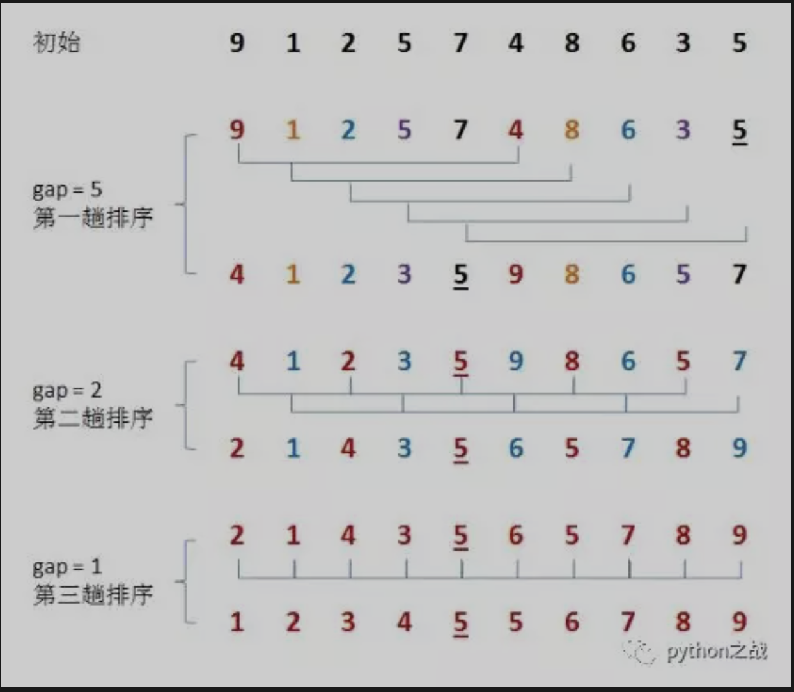
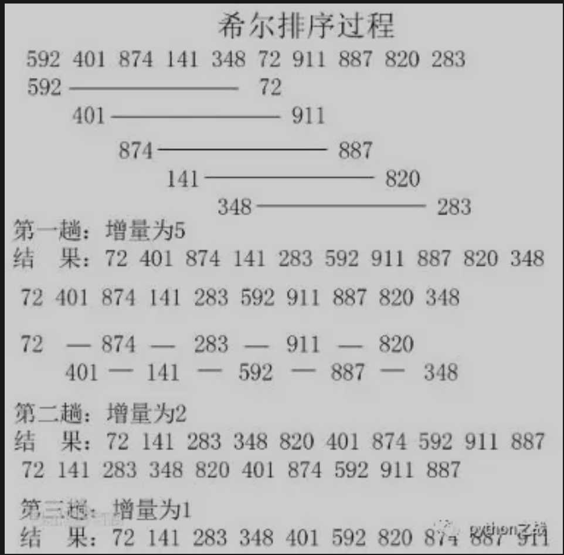

# python实现希尔排序算法
希尔排序是插入排序的一种又称“缩小增量排序”，是直接插入排序算法的一种更高效的改进版本。希尔排序是非稳定排序算法。<br>
希尔排序是把记录按下标的一定增量分组，对每组使用直接插入排序算法排序；随着增量逐渐减少，每组包含的关键词越来越多，
当增量减至1时，整个文件恰被分成一组，算法便终止<br>
希尔排序的核心是对步长的理解，步长是进行相对比较的两个元素之间的距离，随着步长的减小，
相对元素的大小会逐步区分出来并向两端聚拢，当步长为1的时候，就完成最后一次比较，那么序列顺序就出来了。<br>

如上面实例：第一次排序步长为5，那么需要比较的元素对为：9-4 1-8 2-6 5-3 7-5，只需要将这几组元素比比较并交换位置；
然后开始第二轮的比较。<br>
```
def shell_sort(items):
    """
    希尔排序
    :param items: 
    :return: 
    """
    n = len(items)
    step = n // 2
    while step > 0:
        for cur in range(step, n):
            i = cur
            while i >= step and items[i-step] > items[i]:
                items[i - step], items[i] = items[i], items[i-step]
                i -= step
        step = step // 2
```
不需要大量的辅助空间，和归并排序一样容易实现。希尔排序是基于插入排序的一种算法，在此算法基础之上增加了一个新的特性，提高了效率。
希尔排序没有快速排序算法快，因此中等大小规模数据排序中表现良好，对规模非常大的数据排序不是最优选择。<br>
希尔算法在最坏的情况下和平均情况下执行效率相差不是很多，与此同时快速排序在最坏的情况下执行的效率会非常差，
几乎任何排序工作在开始时都可以用希尔排序，本质上讲，希尔排序算法是直接插入排序算法的一种改进，减少了其复制的次数，
速度要快很多。<br>

