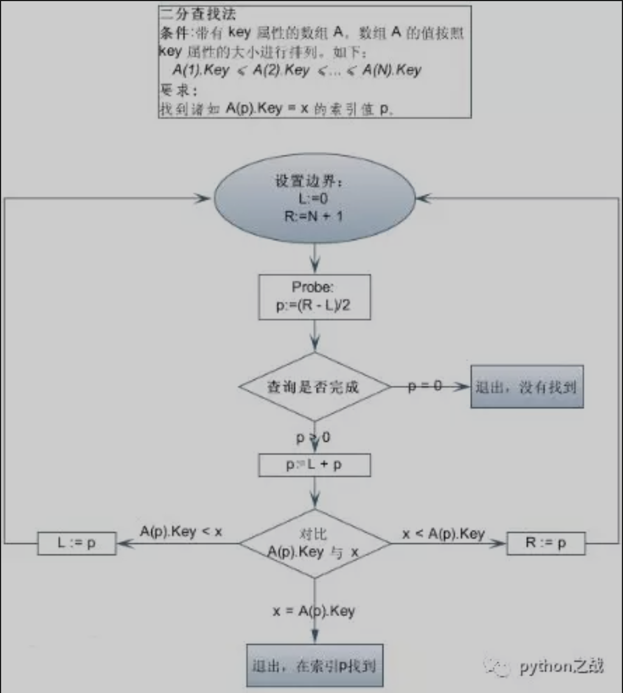

# python实现二分查找算法
二分查找算法，是常见的搜索算法之一，适用于有序的序列，通过将序列不断的对折分为区间，从而确定查找值是否存在，优点是速度快。<br>
首先，假设表中元素是按升序排列，将表中间位置记录的关键字与查找关键字比较，如果两者相等，则查找成功；
否则利用中间位置记录将表分成前、后两个子表，如果中间位置记录的关键字大于查找关键字，则进一步查找前一子表，
否则进一步查找后一子表。重复以上过程，直到找到满足条件的记录，使查找成功，或直到子表不存在为止，此时查找不成功。<br>
##### 使用python递归实现其算法：
```
def binary_search(items: list, item: str) -> float:

    if not len(items):
        return False
    if item > items[-1]:
        return False
    elif item < items[0]:
        return False
    n = len(items) // 2
    if items[n] == item:
        return True
    else:
        if items[n] < item:
            return binary_search(items[n:], item)
        else:
            return binary_search(items[:n], item)
```
二分查找是应用在数据量较大的场景中，如一些图片的RGB数组操作中，典型的是在滑块验证中使用二分法来确定最佳距离。<br>
```
def match(self, target, template):
        img_rgb = cv2.imread(target)
        img_gray = cv2.cvtColor(img_rgb, cv2.COLOR_BGR2GRAY)
        template = cv2.imread(template,0)
        run = 1
        w, h = template.shape[::-1]
        print(w, h)
        res = cv2.matchTemplate(img_gray,template,cv2.TM_CCOEFF_NORMED) 

        # 使用二分法查找阈值的精确值 
        L = 0
        R = 1
        while run < 20:
            run += 1
            threshold = (R + L) / 2
            print(threshold)
            if threshold < 0:
                print('Error')
                return None
            loc = np.where( res >= threshold)
            print(len(loc[1]))
            if len(loc[1]) > 1:
                L += (R - L) / 2
            elif len(loc[1]) == 1:
                print('目标区域起点x坐标为：%d' % loc[1][0])
                break
            elif len(loc[1]) < 1:
                R -= (R - L) / 2

        for pt in zip(*loc[::-1]):
            cv2.rectangle(img_rgb, pt, (pt[0] + w, pt[1] + h), (7, 279, 151), 2)
        cv2.imshow('Dectected', img_rgb)
        cv2.waitKey(0)
        cv2.destroyAllWindows()
        return loc[1][0]
```
