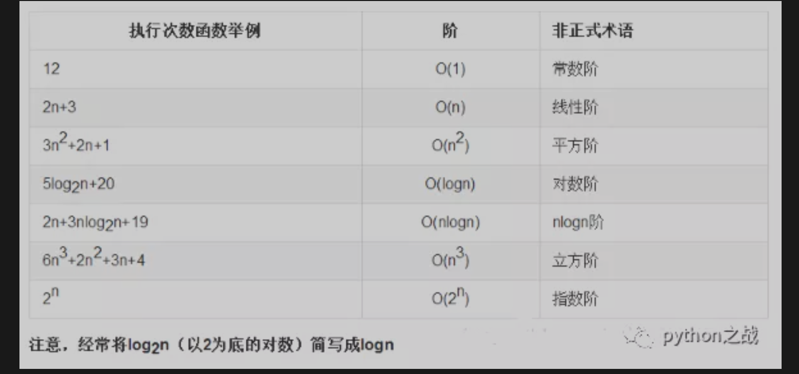
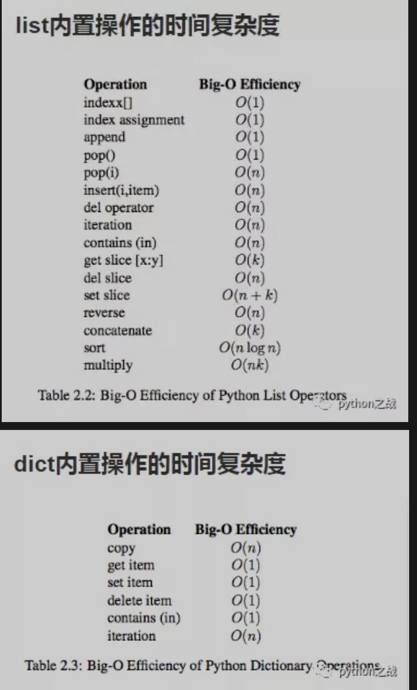

# 数据结构和算法对python意味着什么？
数据结构和算法对于python而言是他的灵魂；程序是数据结构加上算法来实现的，对于任何一门编程语言都离不开数据结构和算法， 
但是对于python而言内置了基础的数据结构如列表、字典、集合等，再加上众多包，所以弱化了数据结构和算法的使用。 
但是在一些特定领域对数据结构和算法的要求也很高，如大数据分析和人工智能之中应用广泛；
同时数据结构和算法关系程序运行的效率，是每个程序员不得不考虑的问题。 
本月专题是python数据结构和算法；数据结构将涉及顺序表、链表、堆栈、队列、树、二叉树、平衡二叉树、红黑树； 
算法将涉及排序算法（冒泡排序、选择排序、插入排序、快速排序、希尔排序、归并排序）、
查找算法（顺序查找、二分法查找、二叉树查找、哈希查找）。 
#### 对于算法性能的衡量问题
算法性能的衡量不再是以运行开始到运行结束的时间来衡量，因为对于不同性能的计算机会产生不同的差异，
所以算法的衡量主要以时间复杂度（以一种趋势和运算数量级来表示）。 
时间复杂度：假设存在函数g，使得算法A处理规模为n的问题示例所用时间为T(n)=O(g(n))，则称O(g(n))为算法A的渐近时间复杂度，
简称时间复杂度，记为T(n)，它主要以算法的趋势和数量级来看，如100*n的平方与1000*n的平方，他们的时间复杂度是相同的。 
就像迭代输出一个n*n的多维数组，他的时间复杂度就是N*N即n的平方 

python内置数据结构（列表、字典）的操作时间复杂度如下： 

针对列表而言，append时间复杂度优于insert，pop（）优于pop(i)那是因为数据结构导致了操作前面位置的元素要挪动该元素之后的元素，
所以算法对我们的性能性能提升关键。