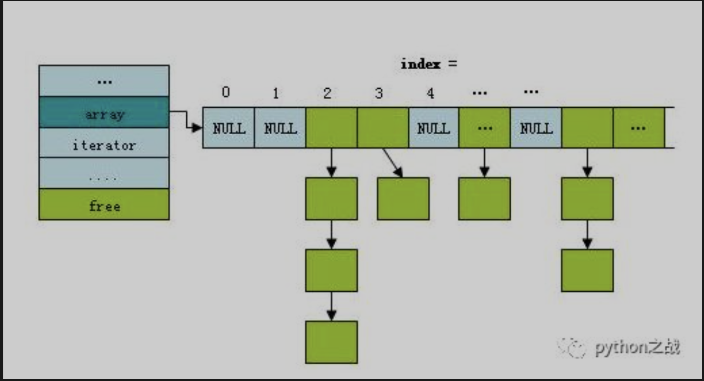

# python中的哈希表数据结构
散列表（Hash table，也叫哈希表），是根据关键码值(Key value)而直接进行访问的数据结构。也就是说，
它通过把关键码值映射到表中一个位置来访问记录，以加快查找的速度。这个映射函数叫做散列函数，存放记录的数组叫做散列表。<br>
python中的dict类型就是哈希表的原理，存储方式是key-value，通过键来快速的访问value，字典在访问操作上时间复杂度为O(1)。<br>
用python实现一个简单的哈希表：key为纯数字作为索引，使用线性表存储 <br>
```
class HashTable:
    def __init__(self, size):
        self.elem = [None for i in range(size)]  # 使用list数据结构作为哈希表元素保存方法
        self.count = size  # 最大表长

    def hash(self, key):
        return key % self.count  # 散列函数采用除留余数法

    def insert_hash(self, key, value):
        """插入关键字到哈希表内"""
        address = self.hash(key)  # 求散列地址
        while self.elem[address]:  # 当前位置已经有数据了，发生冲突。
            address = (address + 1) % self.count  # 线性探测下一地址是否可用
        self.elem[address] = value  # 没有冲突则直接保存。

    def search_hash(self, key):
        """查找关键字，返回布尔值"""
        star = address = self.hash(key)
        while self.elem[address] != key:
            address = (address + 1) % self.count
            if not self.elem[address] or address == star:  # 说明没找到或者循环到了开始的位置
                return False
        return True
```
若关键字为k，则其值存放在f(k)的存储位置上。由此，不需比较便可直接取得所查记录。
称这个对应关系f为散列函数，按这个思想建立的表为散列表。<br>
对不同的关键字可能得到同一散列地址，即k1≠k2，而f(k1)=f(k2)，这种现象称为冲突（英语：Collision）。
具有相同函数值的关键字对该散列函数来说称做同义词。综上所述，根据散列函数f(k)和处理冲突的方法将一组关键字映射到一个
有限的连续的地址集（区间）上，并以关键字在地址集中的“像”作为记录在表中的存储位置，这种表便称为散列表，
这一映射过程称为散列造表或散列，所得的存储位置称散列地址。<br>
若对于关键字集合中的任一个关键字，经散列函数映象到地址集合中任何一个地址的概率是相等的，
则称此类散列函数为均匀散列函数（Uniform Hash function），这就是使关键字经过散列函数得到一个“随机的地址”，从而减少冲突。<br>
