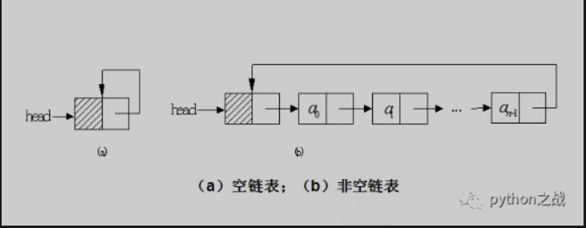
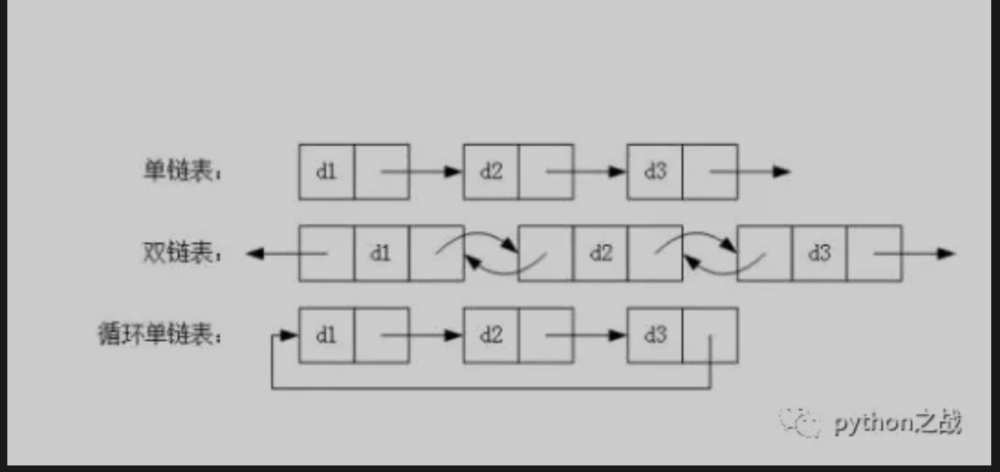

# python实现单向循环链表数据结构及其方法
首先要说明一下研究数据结构有什么用，可能就像高数之类的在生活中并没有多少用处，但是离不开他，很多大公司面试也会问这个东西；
但是要落实到某一个具体的业务场景，我也不知道，但并不代表这些东西没用，也可能是这些模型只是为了让我们能理解更多有用的东西<br>
今天说的是单向循环链表，昨天说了单向链表《python实现单向链表数据结构及其基本方法》，
在此基础上我们说单向循环链表，其基本模型示图如下：<br>

只不过在单向链表的基础上，最后一个节点纸箱头部，定义基本节点对象和链条对象。<br>
```
class Node:
    def __init__(self, item):
        self.item = item  # 该节点值
        self.next = None   #  连接一下一个节点


class SinCycLinkedlist:

    def __init__(self):
        self._head = Node
```
然后实现循环链表对象的基本属性方法：是否为空、长度<br>
```
class SinCycLinkedlist:

    def __init__(self):
        self._head = None

    def is_empty(self):
        """
        是否为空链表
        :return:
        """
        return None == self._head

    @property
    def length(self):
        """
        链表长度
        :return:
        """
        if self.is_empty():
            return 0
        n = 1
        cur = self._head
        while cur != self._head:
            cur = cur.naxt
            n += 1
        return 1
```
接着我们再实现涉及所有节点的一些操作：遍历节点、是否存在指定节点。<br>
```
class SinCycLinkedlist:

    def __init__(self):
        self._head = None

    def is_empty(self):
        """
        是否为空链表
        :return:
        """
        return None == self._head

    @property
    def length(self):
        """
        链表长度
        :return:
        """
        if self.is_empty():
            return 0
        n = 1
        cur = self._head
        while cur != self._head:
            cur = cur.naxt
            n += 1
        return n

    def ergodic(self):
        """
        遍历所有节点
        :return:
        """
        if self.is_empty():
            raise ValueError('error null')
        cur = self._head
        print(cur.item)
        while cur != self._head:
            cur = cur.naxt
            print(cur.item)

    def search(self, item):
        """查找节点是否存在"""
        if self.is_empty():
            raise ValueError('error null')
        cur = self._head
        if cur.item == item:
            return True
        while cur != self._head:
            if cur.item == item:
                return True
        return False
```
这些基本操作和单向链表基本一致，但是不同的是判断最后一个元素的标志不再是next==None而是next指向了头部指向的节点，
这就是最后一个节点。<br>
接下来实现操作节点增减的头部添加，尾部添加，任意位置添加、删除操作。<br>
```
class Node:
    def __init__(self, item):
        self.item = item  # 该节点值
        self.next = None   #  连接一下一个节点


class SinCycLinkedlist:

    def __init__(self):
        self._head = None

    def is_empty(self):
        """
        是否为空链表
        :return:
        """
        return None == self._head

    @property
    def length(self):
        """
        链表长度
        :return:
        """
        if self.is_empty():
            return 0
        n = 1
        cur = self._head
        while cur.next != self._head:
            cur = cur.next
            n += 1
        return n

    def ergodic(self):
        """
        遍历所有节点
        :return:
        """
        if self.is_empty():
            raise ValueError('error null')
        cur = self._head
        print(cur.item)
        while cur.next != self._head:
            cur = cur.next
            print(cur.item)

    def search(self, item):
        """查找节点是否存在"""
        if self.is_empty():
            raise ValueError('error null')
        cur = self._head
        if cur.item == item:
            return True
        while cur != self._head:
            if cur.item == item:
                return True
        return False

    def add(self, item):
        """
        头部添加
        :param item:
        :return:
        """
        node = Node(item)
        if self.is_empty():
            self._head = node
            node.next = node
        else:
            cur = self._head
            while cur.next != self._head:
                cur = cur.next
            node.next = self._head
            self._head = node
            cur.next = node

    def append(self, item):
        """
        尾部添加节点
        :param item:
        :return:
        """
        node = Node(item)
        if self.is_empty():
            self.add(item)
        else:
            cur = self._head
            while cur.next != self._head:
                cur = cur.next
            cur.next = node
            node.next = self._head

    def insert(self, index, item):
        """
        任意位置插入节点
        :param item:
        :return:
        """
        node = Node(item)
        if index+1 >= self.length:
            self.append(item)
        elif index == 0:
            self.add(item)
        else:
            cur = self._head
            n = 1
            while cur.next != self._head:
                pre = cur
                cur = cur.next
                if n == index:
                    break
                n += 1
            pre.next = node
            node.next = cur

    def delete(self, item):
        """
        删除元素
        :param item:
        :return:
        """
        # 若链表为空，则直接返回
        if self.is_empty():
            return
        cur = self._head
        pre = None
        # 若头节点的元素就是要查找的元素item
        if cur.item == item:
            # 如果链表不止一个节点
            if cur.next != self._head:
                while cur.next != self._head:
                    cur = cur.next
                cur.next = self._head.next
                self._head = self._head.next
            else:
                # 链表只有一个节点
                self._head = None
        else:
            pre = self._head
            # 第一个节点不是要删除的
            while cur.next != self._head:
                if cur.item == item:
                    pre.next = cur.next
                    return
                else:
                    pre = cur
                    cur = cur.next
            # cur 指向尾节点
            if cur.item == item:
                pre.next = cur.next
```


