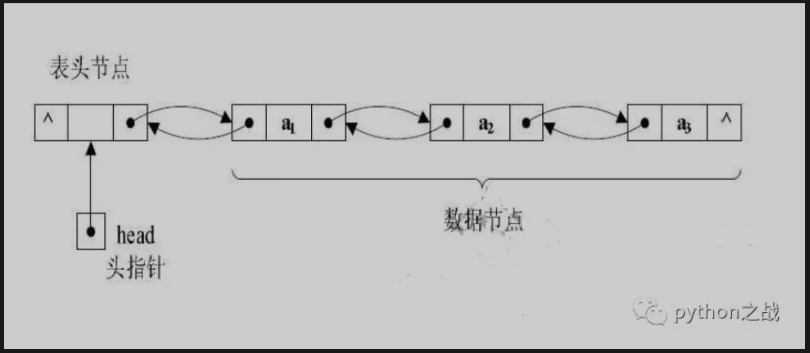
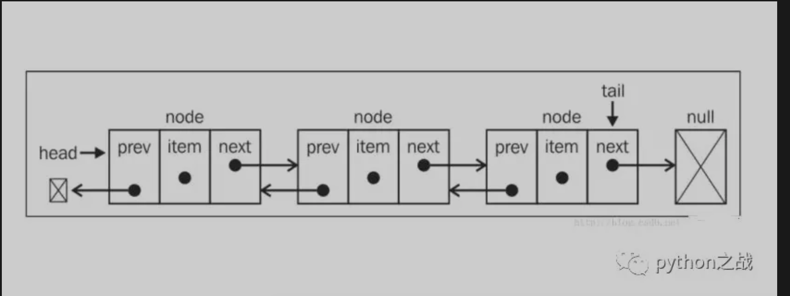

# python实现双向链表基本结构及其基本方法
双向链表是在单向链表的基础上更为复杂的数据结构，其中一个节点除了含有自身信息外，还应该含有下连接一下个节点和上一个节点的信息。<br>
双向链表适用于需要双向查找节点值的场景中，在数据量难以估计并且数据增删操作频繁的场景中，双向链表有一定优势；
链表在内存中呈现的状态是离散的地址块，不需要像列表一样预先分配内存空间，在内存的充分利用上更胜一筹，不过增加了一些额外开销<br>
##### 双向链表结构如图：

##### 定义基本的节点类和链表类：
```
class Node:
    """节点类"""
    def __init__(self, item):
        self.item = item
        self.next = None
        self.prev = None


class DLinkList:
    """
    双向列表类
    """
    def __init__(self):
        self.head = None
```
时间双向链表类的基本属性：是否为空，链表长度、链表遍历；判断链表是否为空只需要看头部head是否指向空，
链表遍历只需要从头部到最后一个节点的下一个节点指向为空的情况，同时链表长度也是根据最后一个节点的下一个节点是否指向空来判断，
基本实现如下：<br>
```
class Node:
    """节点类"""
    def __init__(self, item):
        self.item = item
        self.next = None
        self.prev = None


class DLinkList:
    """
    双向列表类
    """
    def __init__(self):
        self._head = None

    @property
    def is_empty(self):
        return None == self._head

    @property
    def length(self):
        if self.is_empty:
            return 0
        n = 1
        cur = self._head
        while None != cur.next:
            cur = cur.next
            n += 1
        return n

    @property
    def ergodic(self):
        if self.is_empty:
            raise ValueError('ERROR NULL')
        cur = self._head
        print(cur.item)
        while None != cur.next:
            cur = cur.next
            print(cur.item)
        return True
```
接下来实现添加节点相关的操作，在头部添加、任意位置添加、尾部添加，注意在任意插入节点的时候，需要对节点进行遍历并计数，
注意计数起始是1，而不是0，对应的节点是从第二个节点开始。<br>
```
class Node:
    """节点类"""
    def __init__(self, item):
        self.item = item
        self.next = None
        self.prev = None


class DLinkList:
    """
    双向列表类
    """
    def __init__(self):
        self._head = None

    @property
    def is_empty(self):
        """
        是否为空
        :return:
        """
        return None == self._head

    @property
    def length(self):
        """
        链表长度
        :return:
        """
        if self.is_empty:
            return 0
        n = 1
        cur = self._head
        while None != cur.next:
            cur = cur.next
            n += 1
        return n

    @property
    def ergodic(self):
        """
        遍历链表
        :return:
        """
        if self.is_empty:
            raise ValueError('ERROR NULL')
        cur = self._head
        print(cur.item)
        while None != cur.next:
            cur = cur.next
            print(cur.item)
        return True

    def add(self, item):
        """
        在头部添加节点
        :param item:
        :return:
        """
        node = Node(item)
        if self.is_empty:
            self._head = node
        else:
            node.next = self._head
            self._head.prev = node
            self._head = node

    def append(self, item):
        """
        在尾部添加节点
        :return:
        """
        if self.is_empty:
            self.add(item)
        else:
            node = Node(item)
            cur = self._head
            while None != cur.next:
                cur = cur.next
            cur.next = node
            node.prev = cur

    def insert(self, index, item):
        """
        在任意位置插入节点
        :param index:
        :param item:
        :return:
        """
        if index == 0:
            self.add(item)
        elif index+1 >= self.length:
            self.append(item)
        else:
            n = 1
            node = Node(item)
            cur = self._head
            while Node != cur.next:
                pre = cur
                cur = cur.next
                if n == index:
                    break
            pre.next = node
            node.prev = pre
            node.next = cur
            cur.prev = node
```
在实现较为复杂的删除节点操作和判断节点是否存在的方法。<br>
```
class Node:
    """节点类"""
    def __init__(self, item):
        self.item = item
        self.next = None
        self.prev = None


class DLinkList:
    """
    双向列表类
    """
    def __init__(self):
        self._head = None

    @property
    def is_empty(self):
        """
        是否为空
        :return:
        """
        return None == self._head

    @property
    def length(self):
        """
        链表长度
        :return:
        """
        if self.is_empty:
            return 0
        n = 1
        cur = self._head
        while None != cur.next:
            cur = cur.next
            n += 1
        return n

    @property
    def ergodic(self):
        """
        遍历链表
        :return:
        """
        if self.is_empty:
            raise ValueError('ERROR NULL')
        cur = self._head
        print(cur.item)
        while None != cur.next:
            cur = cur.next
            print(cur.item)
        return True

    def add(self, item):
        """
        在头部添加节点
        :param item:
        :return:
        """
        node = Node(item)
        if self.is_empty:
            self._head = node
        else:
            node.next = self._head
            self._head.prev = node
            self._head = node

    def append(self, item):
        """
        在尾部添加节点
        :return:
        """
        if self.is_empty:
            self.add(item)
        else:
            node = Node(item)
            cur = self._head
            while None != cur.next:
                cur = cur.next
            cur.next = node
            node.prev = cur

    def insert(self, index, item):
        """
        在任意位置插入节点
        :param index:
        :param item:
        :return:
        """
        if index == 0:
            self.add(item)
        elif index+1 >= self.length:
            self.append(item)
        else:
            n = 1
            node = Node(item)
            cur = self._head
            while Node != cur:
                pre = cur
                cur = cur.next
                if n == index:
                    break
            pre.next = node
            node.prev = pre
            node.next = cur
            cur.prev = node

    def search(self, item):
        """
        查找节点是否存在
        :param item:
        :return:
        """
        if self.is_empty:
            raise ValueError("ERROR NULL")
        cur = self._head
        while None != cur:
            if cur.item == item:
                return True
            cur = cur.next
        return False

    def deltel(self, item):
        """删除节点元素"""
        if self.is_empty:
            raise ValueError('ERROR NULL')
        else:
            cur = self._head
            while None != cur:
                if cur.item == item:
                    if not cur.prev:  # 第一个节点
                        if None != cur.next:  # 不止一个节点
                            self._head = cur.next
                            cur.next.prev = None
                        else:  # 只有一个节点
                            self._head = None
                    else:  # 不是第一个节点
                        if cur.next == None:  # 最后一个节点
                            cur.prev.next = None
                        else:  # 中间节点
                            cur.prev.next = cur.next
                            cur.next.prev = cur.prev
                cur = cur.next
```
注意在删除节点的时候要考虑几种特殊情况:删除节点为第一个节点，并且链表只有一个节点；删除节点为第一个节点并且链表长度大于1；
删除节点是中间节点；删除节点是最后一个节点；<br>

