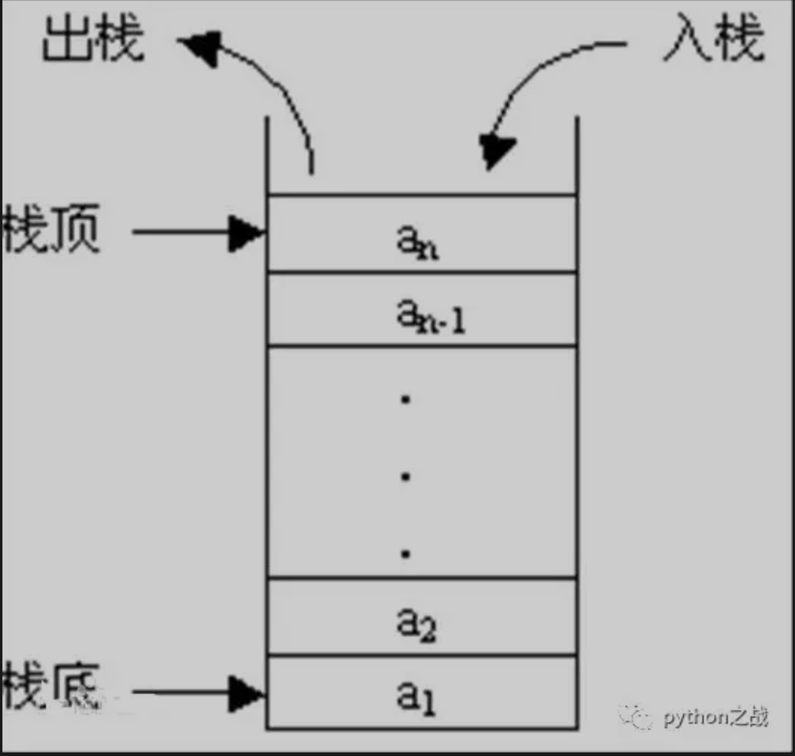
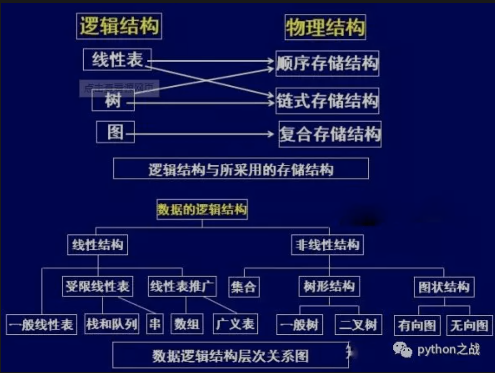

# python实现堆栈数据结构及其基本方法
栈（stack）又名堆栈，它是一种运算受限的线性表。其限制是仅允许在表的一端进行插入和删除运算。这一端被称为栈顶，相对地，把另一端称为栈底。
向一个栈插入新元素又称作进栈、入栈或压栈，它是把新元素放到栈顶元素的上面，使之成为新的栈顶元素；
从一个栈删除元素又称作出栈或退栈，它是把栈顶元素删除掉，使其相邻的元素成为新的栈顶元素。<br>
##### 栈可以用来在函数调用的时候存储断点，做递归时要用到栈，其基本模型如下：

在python中已经有实现栈的数据结构，在queue库中的LifoQueue就是一种堆栈，
堆栈的实现也是线性表，在Python的queue中是通过列表这一线性顺序表实现的，其LifoQueue源码如下：<br>
```
class LifoQueue(Queue):
    '''Variant of Queue that retrieves most recently added entries first.'''

    def _init(self, maxsize):
        self.queue = []

    def _qsize(self):
        return len(self.queue)

    def _put(self, item):
        self.queue.append(item)

    def _get(self):
        return self.queue.pop()
```
下面我们实现一个自定义的堆栈结构，首先定义一个堆栈类：<br>
```
class Stack:
    """堆栈结构类"""
    def __init__(self):
        self._item = []

    def push(self, item):
        """
        添加新元素
        :param item:
        :return:
        """
        self._item.append(item)

    @property
    def size(self):
        """
        返回堆栈大小
        :return:
        """
        return len(self._item)

    @property
    def is_empty(self):
        """
        判断是否为空
        :return:
        """
        return not self._item

    def pop(self):
        """
        弹出栈顶元素
        :return:
        """
        return self._item.pop()

    def peek(self):
        """
        返回栈顶元素
        :return:
        """
        return self._item[-1]
```
上面实现的只是基础模型，缺少异常处理和其他相关的机制，用列表实现堆栈，安全性不是很高，
但是如果使用链表使用的话一次只能按序获取一个元素，从链表一端到另一端，这样安全性会更高。<br>
