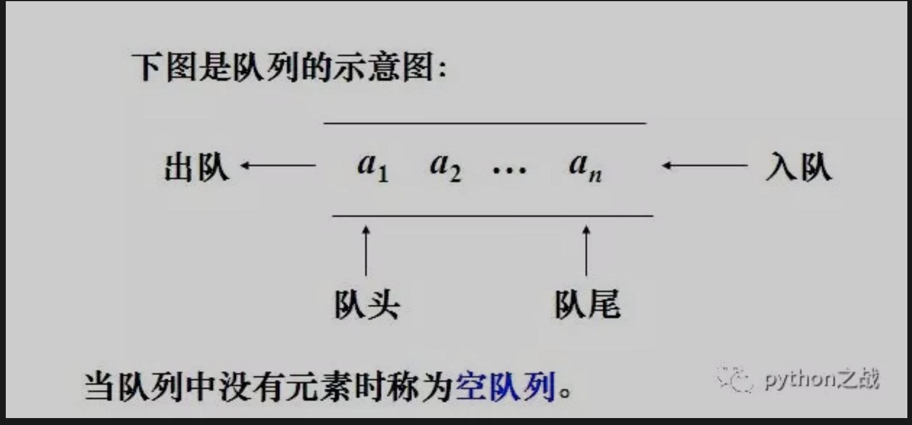
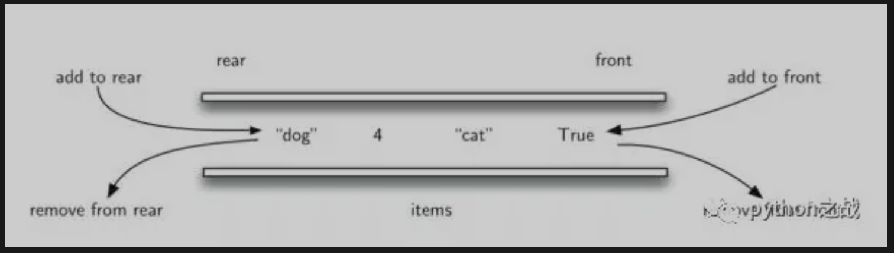

# Python实现双端队列数据结构及其基本方法
队列是一种特殊的线性表，是一种先进先出（FIFO）的数据结构。它只允许在表的前端（front）进行删除操作，而在表的后端（rear）进行插入操作。
进行插入操作的端称为队尾，进行删除操作的端称为队头，队列中没有元素时，称为空队列。<br>

队列可由线性表来实现，包括列表和链表都可实现队列，不过在安全性上来说链表比较安全，但是增加额外的内存开销，一般考虑列表来实现队列。<br>
查看Python队列库queue提供的队列源码如下：<br>
```
class Queue:
    '''Create a queue object with a given maximum size.

    If maxsize is <= 0, the queue size is infinite.
    '''

    def __init__(self, maxsize=0):
        self.maxsize = maxsize
        self._init(maxsize)

        # mutex must be held whenever the queue is mutating.  All methods
        # that acquire mutex must release it before returning.  mutex
        # is shared between the three conditions, so acquiring and
        # releasing the conditions also acquires and releases mutex.
        self.mutex = threading.Lock()

        # Notify not_empty whenever an item is added to the queue; a
        # thread waiting to get is notified then.
        self.not_empty = threading.Condition(self.mutex)

        # Notify not_full whenever an item is removed from the queue;
        # a thread waiting to put is notified then.
        self.not_full = threading.Condition(self.mutex)

        # Notify all_tasks_done whenever the number of unfinished tasks
        # drops to zero; thread waiting to join() is notified to resume
        self.all_tasks_done = threading.Condition(self.mutex)
        self.unfinished_tasks = 0

    def task_done(self):
        '''Indicate that a formerly enqueued task is complete.

        Used by Queue consumer threads.  For each get() used to fetch a task,
        a subsequent call to task_done() tells the queue that the processing
        on the task is complete.

        If a join() is currently blocking, it will resume when all items
        have been processed (meaning that a task_done() call was received
        for every item that had been put() into the queue).

        Raises a ValueError if called more times than there were items
        placed in the queue.
        '''
        with self.all_tasks_done:
            unfinished = self.unfinished_tasks - 1
            if unfinished <= 0:
                if unfinished < 0:
                    raise ValueError('task_done() called too many times')
                self.all_tasks_done.notify_all()
            self.unfinished_tasks = unfinished

    def join(self):
        '''Blocks until all items in the Queue have been gotten and processed.

        The count of unfinished tasks goes up whenever an item is added to the
        queue. The count goes down whenever a consumer thread calls task_done()
        to indicate the item was retrieved and all work on it is complete.

        When the count of unfinished tasks drops to zero, join() unblocks.
        '''
        with self.all_tasks_done:
            while self.unfinished_tasks:
                self.all_tasks_done.wait()

    def qsize(self):
        '''Return the approximate size of the queue (not reliable!).'''
        with self.mutex:
            return self._qsize()

    def empty(self):
        '''Return True if the queue is empty, False otherwise (not reliable!).

        This method is likely to be removed at some point.  Use qsize() == 0
        as a direct substitute, but be aware that either approach risks a race
        condition where a queue can grow before the result of empty() or
        qsize() can be used.

        To create code that needs to wait for all queued tasks to be
        completed, the preferred technique is to use the join() method.
        '''
        with self.mutex:
            return not self._qsize()

    def full(self):
        '''Return True if the queue is full, False otherwise (not reliable!).

        This method is likely to be removed at some point.  Use qsize() >= n
        as a direct substitute, but be aware that either approach risks a race
        condition where a queue can shrink before the result of full() or
        qsize() can be used.
        '''
        with self.mutex:
            return 0 < self.maxsize <= self._qsize()

    def put(self, item, block=True, timeout=None):
        '''Put an item into the queue.

        If optional args 'block' is true and 'timeout' is None (the default),
        block if necessary until a free slot is available. If 'timeout' is
        a non-negative number, it blocks at most 'timeout' seconds and raises
        the Full exception if no free slot was available within that time.
        Otherwise ('block' is false), put an item on the queue if a free slot
        is immediately available, else raise the Full exception ('timeout'
        is ignored in that case).
        '''
        with self.not_full:
            if self.maxsize > 0:
                if not block:
                    if self._qsize() >= self.maxsize:
                        raise Full
                elif timeout is None:
                    while self._qsize() >= self.maxsize:
                        self.not_full.wait()
                elif timeout < 0:
                    raise ValueError("'timeout' must be a non-negative number")
                else:
                    endtime = time() + timeout
                    while self._qsize() >= self.maxsize:
                        remaining = endtime - time()
                        if remaining <= 0.0:
                            raise Full
                        self.not_full.wait(remaining)
            self._put(item)
            self.unfinished_tasks += 1
            self.not_empty.notify()

    def get(self, block=True, timeout=None):
        '''Remove and return an item from the queue.

        If optional args 'block' is true and 'timeout' is None (the default),
        block if necessary until an item is available. If 'timeout' is
        a non-negative number, it blocks at most 'timeout' seconds and raises
        the Empty exception if no item was available within that time.
        Otherwise ('block' is false), return an item if one is immediately
        available, else raise the Empty exception ('timeout' is ignored
        in that case).
        '''
        with self.not_empty:
            if not block:
                if not self._qsize():
                    raise Empty
            elif timeout is None:
                while not self._qsize():
                    self.not_empty.wait()
            elif timeout < 0:
                raise ValueError("'timeout' must be a non-negative number")
            else:
                endtime = time() + timeout
                while not self._qsize():
                    remaining = endtime - time()
                    if remaining <= 0.0:
                        raise Empty
                    self.not_empty.wait(remaining)
            item = self._get()
            self.not_full.notify()
            return item

    def put_nowait(self, item):
        '''Put an item into the queue without blocking.

        Only enqueue the item if a free slot is immediately available.
        Otherwise raise the Full exception.
        '''
        return self.put(item, block=False)

    def get_nowait(self):
        '''Remove and return an item from the queue without blocking.

        Only get an item if one is immediately available. Otherwise
        raise the Empty exception.
        '''
        return self.get(block=False)

    # Override these methods to implement other queue organizations
    # (e.g. stack or priority queue).
    # These will only be called with appropriate locks held

    # Initialize the queue representation
    def _init(self, maxsize):
        self.queue = deque()

    def _qsize(self):
        return len(self.queue)

    # Put a new item in the queue
    def _put(self, item):
        self.queue.append(item)

    # Get an item from the queue
    def _get(self):
        return self.queue.popleft()
```
Queue提供了一些基本方法：task_done、join、qsize、empty、full、put、get、put_nowait、get_nowait，
但是他的实现依旧是通过操作内部的私有方法，而这些私有方法是队列的本质。<br>
包括最后的初始化创建一个列表、获取列表长度返回队列大小、以及对列表进行元素操作等，
这一切本质上都是对liest操作。<br>
什么是双端队列？双端队列是在普通队列的基础上，既可以在前端弹出元素也可以在前端插入元素，
既可以在后端插入元素也可以在后端弹出元素，下面来实现这一基本模型。<br>
```
class Deque(object):
    """双端队列"""
    def __init__(self):
        self._items = []

    @property
    def is_empty(self):
        """
        判断队列是否为空
        :return:
        """
        return self._items == []

    @property
    def size(self):
        """
        返回队列大小
        :return:
        """
        return len(self._items)

    def add_front(self, item):
        """
        在队头添加元素
        :param item:
        :return:
        """
        self._items.insert(0, item)

    def add_rear(self, item):
        """
        在队尾添加元素
        :param item:
        :return:
        """
        self._items.append(item)

    def remove_front(self):
        """
        从队头删除元素
        :return:
        """
        return self._items.pop(0)

    def remove_rear(self):
        """
        从队尾删除元素
        :return:
        """
        return self._items.pop()
```
##### 双端队列分类：
输出受限的双端队列：允许在一端进行插入和删除，但在另一端只允许插入的双端队列称为输出受限的双端队列。<br>
输入受限的双端队列：允许在一端进行插入和删除，但在另一端只允许删除的双端队列称为输入受限的双端队列，
而如果限定双端队列从某个端点插入的元素只能从该端点删除，则该双端队列就蜕变为两个栈底相邻接的栈了。<br>
