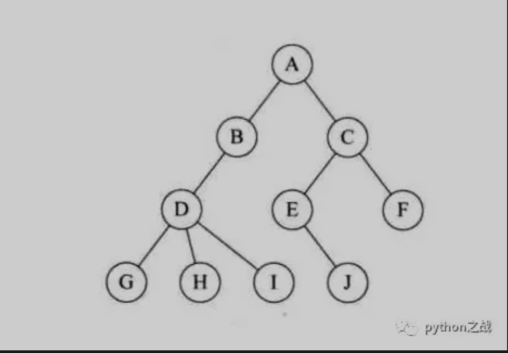
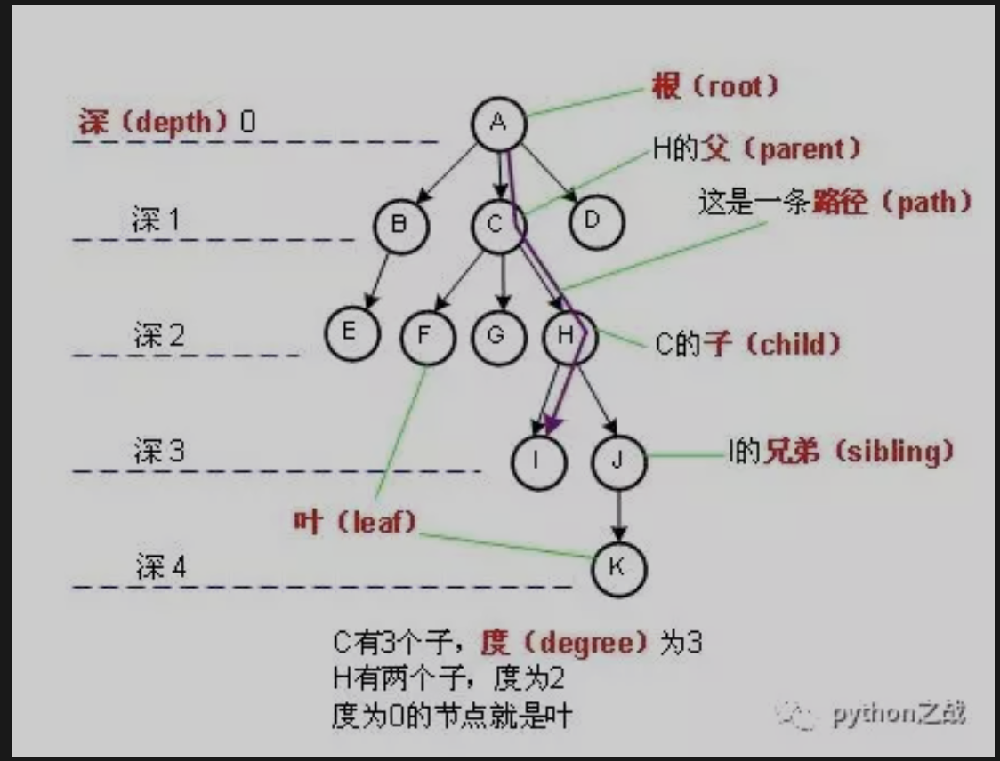

# python中的树数据结构
《顺序表数据结构在python中的应用》<br>
《python实现单向链表数据结构及其基本方法》<br>
《python实现单向循环链表数据结构及其方法》<br>
《python实现双向链表基本结构及其基本方法》<br>
《python实现双向循环链表基本结构及其基本方法》<br>
《python实现堆栈数据结构及其基本方法》<br>
《Python实现双端队列数据结构及其基本方法》<br>
下面将说图形结构中的典型数据机构：树；是一种重要的非线性数据结构，
直观地看，它是数据元素（在树中称为结点）按分支关系组织起来的结构，很象自然界中的树那样。<br>


##### 树的一些基础概念：
节点的度：一个节点含有的子树的个数称为该节点的度；<br>
树的度：一棵树中，最大的节点的度称为树的度；<br>
叶节点或终端节点：度为零的节点；<br>
节点的层次：从根开始定义起，根为第1层，根的子节点为第2层，以此类推；<br>
树的高度或深度：树中节点的最大层次；<br>
森林：由m（m>=0）棵互不相交的树的集合称为森林；<br>
路径：对于一棵子树中的任意两个不同的结点，如果从一个结点出发，按层次<br>
自上而下沿着一个个树枝能到达另一结点，称它们之间存在着一条路径<br>
##### 常用树的分类：
无序树：树中任意节点的子节点之间没有顺序关系，这种树称为无序树，也称为自由树；<br>
有序树：树中任意节点的子节点之间有顺序关系，这种树称为有序树；<br>
二叉树：每个节点最多含有两个子树的树称为二叉树；<br>
    完全二叉树：对于一颗二叉树，假设其深度为d(d>1)。
    除了第d层外，其它各层的节点数目均已达最大值，且第d层所有节点从左向右连续地紧密排列，这样的二叉树被称为完全二叉树，其中满二叉树的定义是所有叶节点都在最底层的完全二叉树;<br>
    平衡二叉树（AVL树）：当且仅当任何节点的两棵子树的高度差不大于1的二叉树；<br>
    排序二叉树（二叉查找树（英语：Binary Search Tree），也称二叉搜索树、有序二叉树）；<br>
    霍夫曼树（用于信息编码）：带权路径最短的二叉树称为哈夫曼树或最优二叉树；<br>
    B树：一种对读写操作进行优化的自平衡的二叉查找树，能够保持数据有序，拥有多余两个子树。<br>
##### 树的储存：
在python中一切皆对象，树也不列外，树在python中可以通过列表和链表来储存。通过列表是将每个节点对象储存，
在逻辑上不过形象，基本不用；用的最多的是通过链表构建一个树对象，其基本属性是根节点，
根节点的左树属性和右树属性连接不同的节点，依次构建一颗庞大的树。<br>
```
class Node(object):
    """节点类"""
    def __init__(self, elem=-1, lchild=None, rchild=None):
        self.elem = elem
        self.lchild = lchild
        self.rchild = rchild


class Tree(object):
    """树类"""
    def __init__(self, root=None):
        self.root = root
```
后面将主要说二叉树、平衡二叉树、红黑树及其相关的一些重要方法的python实现。<br>
