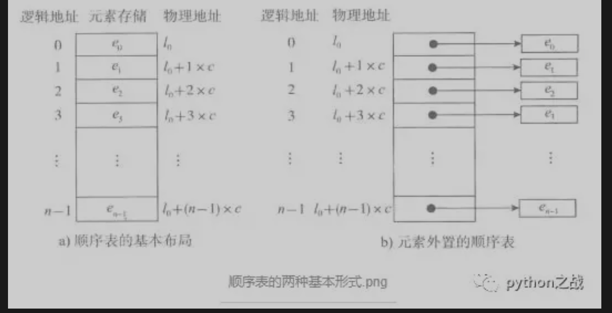
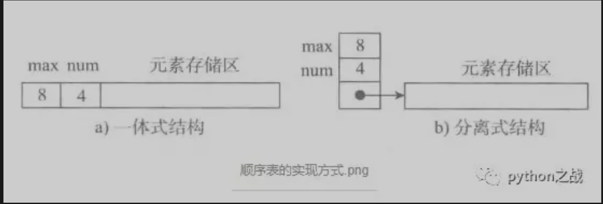
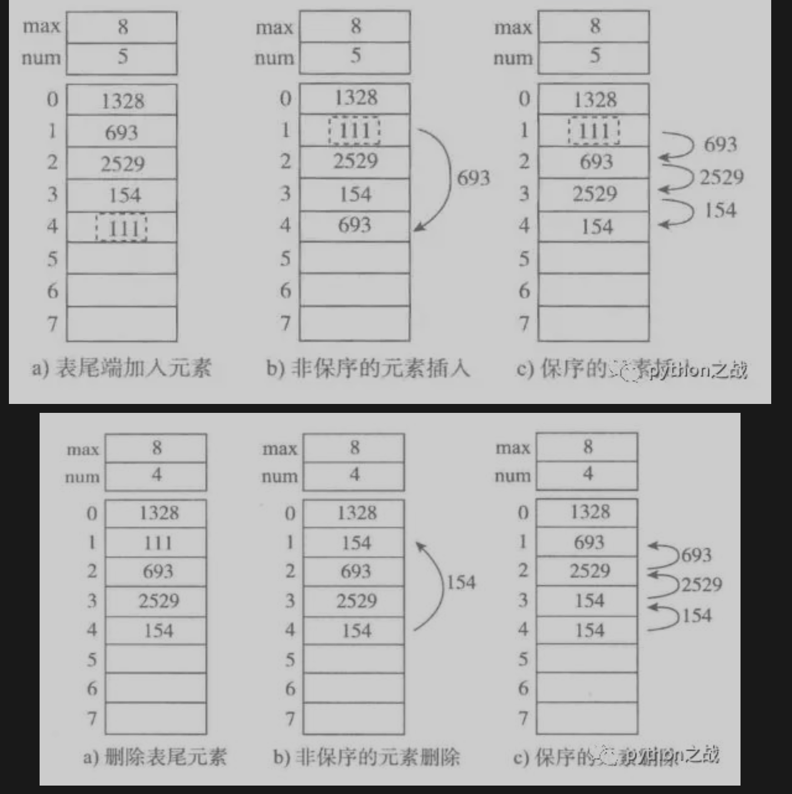

# 顺序表数据结构在python中的应用
数据结构不仅仅指的数据值在逻辑上的结构，更有在存储空间上的位置结构，顺序表，故名思意是有一定顺序的数据结构。 
##### 顺序表最基本模型如图：

对于基本布局顺序表而言，它存储相同单元大小并且在内存地址上连续的数据，逻辑地址是其元素的逻辑顺序，
物理地址第一个元素的内存地址加上离第一个元素的距离，
如：e1物理地址是l0，那么e2的物理地址是e1的地址加上e1所占用的大小c，以此类推，en的物理地址是l0+（n-1）*c。) 
这种基本布局出现了一个问题，如果其中的元素大小不统一，那么岂不是要用最大存储单元作为基本单位，非常浪费空间，
因此出现了外置顺序表，它是将元素的索引以相同单元大小连续存放，索引记录对应数据在内存上的地址，
那么我们可以通过基本布局的方式去找到索引，再根据索引找到数据。 
##### 在熟悉了顺序表的基本模型后，我们再看顺表的结构，如图所示：

实际的顺序表包含两部分，一部分是顺序表的记录信息块（含顺序表容量、元素个数），
一部分是数据块，这两部放在一起是一体式结构，如果分离通过索引连接是分离式结构。 
顺序表含有容量和容量的使用情况信息，那么很容易就实现扩容，
其扩容方式有两种：一种是频繁的固定扩容，即每次增加固定单位的容量，因此会平凡扩容；另一种是倍增的扩容，
即按照2、4、8、16这种方式来扩，这样扩容频率低，但可能造成浪费。 
在python中list和tuple都是顺序表结构，list是动态顺序表，支持内部结构变化如增加或者减少元素，
而tupele并不支持结构的改变，其他性能和list一致。 
既然我们知道了python中使用最频繁的list内在结构，那我们就应该明白append是在顺序表末尾增加一个元素，
他的时间复杂度是O（1），而insert插入函数是将插入位置之后的元素依次向下挪动一个位置，
复杂度是O（n）;同理删除一个元素，当删除最后一个位置的元素pop(）只是删除循序表的最后一个位置元素，
如果是删除指定元素，那么该元素其后的元素依次挪动一个位置其时间复杂度为O(n); 
这便是数据结构的意义，它对python性能的提升有指导性的作用。 

