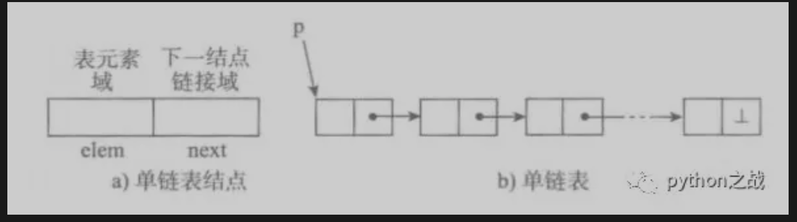
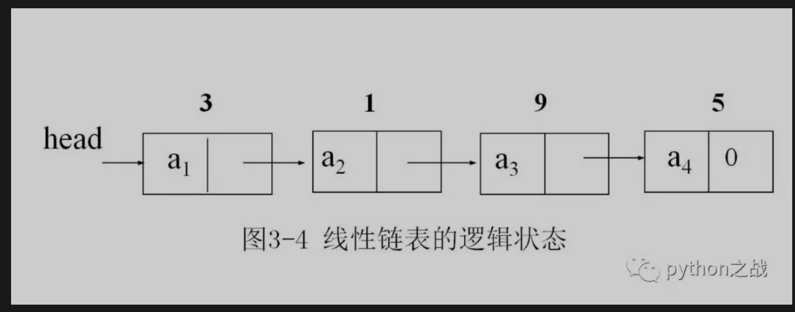

# python实现单向链表数据结构及其基本方法
顺序表和链表作为线性表的典型结构，上一篇已经说了顺序表在python中的典型应用：list和tuple，
《顺序表数据结构在python中的应用》，今天来实现链表的基本结构之一：单向链表<br>
##### 单向链表模型：

链表是一个个节点连接而成，节点由两部分构成：元素域、链接域；链接域链接下一个节点，从而构成一条链条，
而python主要实现单个节点对象，从而构成链条。<br>
##### python实现一个节点对象：
```
class node:
    def __init__(self, item):
        self.item = item  # 该节点值
        self.next = None   #  连接一下一个节点
```
##### 定义一个链条对象：
```
class SinglyLinkedList:
    """链表对象"""
    def __init__(self):
        self._head = None
```
##### 链表对象从头部开始，链接一个个节点，下面我们添加一个在头部和尾部增加节点的方法。
```
class Node:
    def __init__(self, item):
        self.item = item  # 该节点值
        self.next = None   #  连接一下一个节点


class SinglyLinkedList:
    """链表对象"""
    def __init__(self):
        self._head = None

    def add(self, item):
        """
        头部添加节点
        :param item: 节点值
        :return:
        """
        node = Node(item)
        node.next = self._head
        self._head = node

    def append(self, item):
        """
        尾部添加节点
        :param items:
        :return:
        """
        cur = self._head
        if not cur:  # 判断是否为空链表
            self.add(item)
        else:
            node = Node(item)
            while cur.next:
                cur = cur.next
            cur.next = node
```
其中注意在尾部添加节点的时候要判断是否为空链表，如果是空链表就直接用头部添加方法，如果不是空链表，
那么需要遍历到最后一个节点上添加节点。<br>
那我们给链表添加一些实现属性的方法，是否为空、链表长度、遍历链表等。<br>
```
class Node:
    def __init__(self, item):
        self.item = item  # 该节点值
        self.next = None   #  连接一下一个节点


class SinglyLinkedList:
    """链表对象"""
    def __init__(self):
        self._head = None

    @property
    def is_empty(self):
        """
        判断链表是否为空，只需要看头部是否有节点
        :return:
        """
        if self._head:
            return False
        else:
            return True

    @property
    def length(self):
        """
        获取链表长度
        :return:
        """
        cur = self._head
        n = 0
        if not cur:
            return n
        else:
            while cur.next:
                cur = cur.next
                n += 1
            return n+1

    def ergodic(self):
        """
        遍历链表
        :return:
        """
        cur = self._head
        if not cur:
            print('None')
        else:
            while cur.next:
                print(cur.item)
                cur = cur.next
            print(cur.item)
```
接下来继续增加我们链表的插入节点和删除节点以及判断节点是否存在的方法。<br>
```
class Node:
    def __init__(self, item):
        self.item = item  # 该节点值
        self.next = None   #  连接一下一个节点


class SinglyLinkedList:
    """链表对象"""
    def __init__(self):
        self._head = None

    def insert(self, index, item):
        """
        在指定位置插入节点(设置索引从0开始)
        :param item:
        :return:
        """
        if index == 0:  # 当索为0则头部插入
            self.add(item)
        elif index >= self.length:  # 当索引超范围则尾部插入
            self.append(item)
        else:  # 找到插入位置的上一个节点，修改上一个节点的next属性
            cur = self._head
            n = 1
            while cur.next:
                if n == index:
                    break
                cur = cur.next
                n += 1
            node = Node(item)
            node.next = cur.next
            cur.next = node

    def deltel(self, item):
        """
        删除节点
        :param item:
        :return:
        """
        if self.is_empty:  # 节点为空的情况
            raise ValueError("null")
        cur = self._head
        pre = None  # 记录删除节点的上一个节点
        if cur.item == item:  # 当删除节点为第一个的情况
            self._head = cur.next
        while cur.next:
            pre = cur
            cur = cur.next
            if cur.item == item:
                pre.next = cur.next

    def search(self, item):
        """
        查找节点是否存在
        :param item:
        :return:
        """
        cur = self._head
        while None != cur:
            if cur.item == item:
                return True
            cur = cur.next
        return False
```
依此类推，我们可以像列表的方法一下来实现节点的方法，比如还可以设置查找索引，修改节点值等方法，
这种数据数据结构和列表使用方法一样，只不过列表是python内部已经实现了相关的方法，如果要在python中使用链表，
那么我们应该编写自己的链表数据结构，导入即可使用。<br>
完整源码见下：<br>
```
class Node:
    def __init__(self, item):
        self.item = item  # 该节点值
        self.next = None   #  连接一下一个节点


class SinglyLinkedList:
    """链表对象"""
    def __init__(self):
        self._head = None

    def add(self, item):
        """
        头部添加节点
        :param item: 节点值
        :return:
        """
        node = Node(item)
        node.next = self._head
        self._head = node

    def append(self, item):
        """
        尾部添加节点
        :param items:
        :return:
        """
        cur = self._head
        if not cur:  # 判断是否为空链表
            self.add(item)
        else:
            node = Node(item)
            while cur.next:
                cur = cur.next
            cur.next = node

    @property
    def is_empty(self):
        """
        判断链表是否为空，只需要看头部是否有节点
        :return:
        """
        if self._head:
            return False
        else:
            return True

    @property
    def length(self):
        """
        获取链表长度
        :return:
        """
        cur = self._head
        n = 0
        if not cur:
            return n
        else:
            while cur.next:
                cur = cur.next
                n += 1
            return n+1

    def ergodic(self):
        """
        遍历链表
        :return:
        """
        cur = self._head
        if not cur:
            print('None')
        else:
            while cur.next:
                print(cur.item)
                cur = cur.next
            print(cur.item)

    def insert(self, index, item):
        """
        在指定位置插入节点(设置索引从0开始)
        :param item:
        :return:
        """
        if index == 0:  # 当索为0则头部插入
            self.add(item)
        elif index >= self.length:  # 当索引超范围则尾部插入
            self.append(item)
        else:  # 找到插入位置的上一个节点，修改上一个节点的next属性
            cur = self._head
            n = 1
            while cur.next:
                if n == index:
                    break
                cur = cur.next
                n += 1
            node = Node(item)
            node.next = cur.next
            cur.next = node

    def deltel(self, item):
        """
        删除节点
        :param item:
        :return:
        """
        if self.is_empty:  # 节点为空的情况
            raise ValueError("null")
        cur = self._head
        pre = None  # 记录删除节点的上一个节点
        if cur.item == item:  # 当删除节点为第一个的情况
            self._head = cur.next
        while cur.next:
            pre = cur
            cur = cur.next
            if cur.item == item:
                pre.next = cur.next

    def search(self, item):
        """
        查找节点是否存在
        :param item:
        :return:
        """
        cur = self._head
        while None != cur:
            if cur.item == item:
                return True
            cur = cur.next
        return False
```

