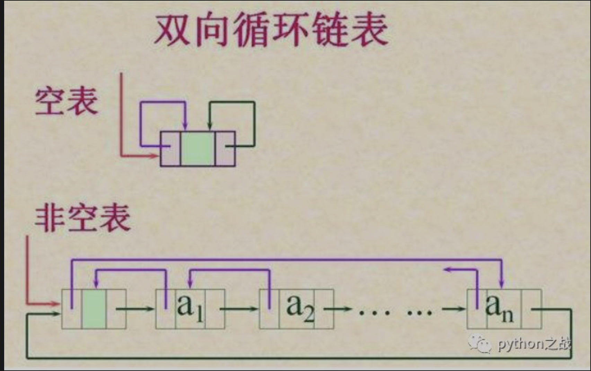
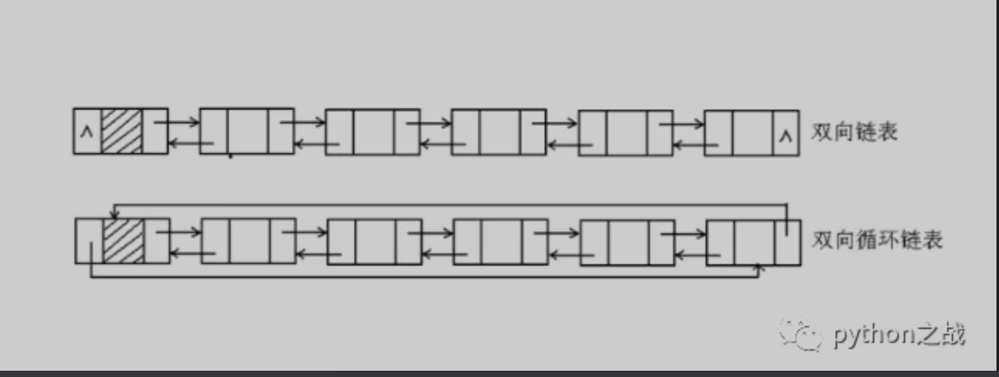

# python实现双向循环链表基本结构及其基本方法
双向循环链表是在双向链表的基础上发展的，双向链表的最后一个节点指向起始节点，起始节点的上一个节点指向最后一个节点，就得到双向循环链表。<br>
双向循环链表比双向链表具有更多的优势，节点的增加和删除有很多优化的地方，从起点开始不必循环完整个链表就可以增加或删除节点。<br>
首先定义双向链表的基本类和节点的基本类：<br>

```
class Node:
    def __init__(self, item):
        self.item = item  # 该节点值
        self.next = None   # 连接一下一个节点
        self.prev = None  # 上一个节点值


class DoubleCircularLinkedList:
    """双向循环列表类"""
    def __init__(self):
        self._head = None
```
下面我们添加基本属性方法的逻辑，注意判断是否为最后一个节点的方式是：最后一个节点的下一个节点是否指向头部指向的节点。<br>
```
class Node:
    def __init__(self, item):
        self.item = item  # 该节点值
        self.next = None   # 连接一下一个节点
        self.prev = None  # 上一个节点值


class DoubleCircularLinkedList:
    """双向循环列表类"""
    def __init__(self):
        self._head = None

    @property
    def is_empty(self):
        """
        判断链表是否为空
        :return:
        """
        return not self._head

    @property
    def length(self):
        """
        链表长度
        :return:
        """
        if self.is_empty:
            return 0
        else:
            cur = self._head.next
            n = 1
            while cur != self._head:
                cur = cur.next
                n += 1
            return n

    @property
    def ergodic(self):
        """
        遍历链表
        :return:
        """
        if self.is_empty:
           raise ValueError("ERROR NULL")
        else:
            cur = self._head.next
            print(self._head.item)
            while cur != self._head:
                print(cur.item)
                cur = cur.next
```
链表类的操作有几个核心的地方，第一个是判断是否为最后一个节点，通过链表的相关特性，
如单向链表最后一个节点的next属性为None、单向循环链表的最后一个节点的next属性等于头部节点；
第二个是使用游标来替代节点指向，这个在操作节点的时候需要有时还需要两个游标，但是对于双向节点而言只需要一个游标，
通过当前节点的属性可以找到上下节点。<br>
继续给对象添加方法：头部插入节点、尾部添加节点、任意位置插入节点。<br>
```
class Node:
    def __init__(self, item):
        self.item = item  # 该节点值
        self.next = None   # 连接一下一个节点
        self.prev = None  # 上一个节点值


class DoubleCircularLinkedList:
    """双向循环列表类"""
    def __init__(self):
        self._head = None

    @property
    def is_empty(self):
        """
        判断链表是否为空
        :return:
        """
        return not self._head

    @property
    def length(self):
        """
        链表长度
        :return:
        """
        if self.is_empty:
            return 0
        else:
            cur = self._head.next
            n = 1
            while cur != self._head:
                cur = cur.next
                n += 1
            return n

    @property
    def ergodic(self):
        """
        遍历链表
        :return:
        """
        if self.is_empty:
           raise ValueError("ERROR NULL")
        else:
            cur = self._head.next
            print(self._head.item)
            while cur != self._head:
                print(cur.item)
                cur = cur.next

    def add(self, item):
        """
        头部添加节点
        :return:
        """
        node = Node(item)
        if self.is_empty:
            node.next = node
            node.prev = node
            self._head = node
        else:
            node.next = self._head
            node.prev = self._head.prev
            self._head.prev.next = node
            self._head.prev = node
            self._head = node

    def append(self, item):
        """
        尾部添加节点
        :param item:
        :return:
        """
        if self.is_empty:
            self.add(item)
        else:
            node = Node(item)
            cur = self._head.next
            while cur.next != self._head:
                cur = cur.next
            cur.next = node
            node.prev = cur
            node.next = self._head
            self._head.prev = node

    def insert(self, index, item):
        """
        任意位置插入节点
        :param item:
        :return:
        """
        if index == 0:
            self.add(item)
        elif index+1 >= self.length:
            self.append(item)
        else:
            cur = self._head.next
            n = 1
            while cur.next != self._head:
                if n == index:
                    break
                cur = cur.next
                n += 1
            node = Node(item)
            node.prev = cur.prev
            cur.prev.next = node
            node.next = cur
            cur.prev = node
```
接着实现判断节点是否存在以及删除指定节点。
```
class Node:
    def __init__(self, item):
        self.item = item  # 该节点值
        self.next = None   # 连接一下一个节点
        self.prev = None  # 上一个节点值


class DoubleCircularLinkedList:
    """双向循环列表类"""
    def __init__(self):
        self._head = None

    @property
    def is_empty(self):
        """
        判断链表是否为空
        :return:
        """
        return not self._head

    @property
    def length(self):
        """
        链表长度
        :return:
        """
        if self.is_empty:
            return 0
        else:
            cur = self._head.next
            n = 1
            while cur != self._head:
                cur = cur.next
                n += 1
            return n

    @property
    def ergodic(self):
        """
        遍历链表
        :return:
        """
        if self.is_empty:
           raise ValueError("ERROR NULL")
        else:
            cur = self._head.next
            print(self._head.item)
            while cur != self._head:
                print(cur.item)
                cur = cur.next

    def add(self, item):
        """
        头部添加节点
        :return:
        """
        node = Node(item)
        if self.is_empty:
            node.next = node
            node.prev = node
            self._head = node
        else:
            node.next = self._head
            node.prev = self._head.prev
            self._head.prev.next = node
            self._head.prev = node
            self._head = node

    def append(self, item):
        """
        尾部添加节点
        :param item:
        :return:
        """
        if self.is_empty:
            self.add(item)
        else:
            node = Node(item)
            cur = self._head.next
            while cur.next != self._head:
                cur = cur.next
            cur.next = node
            node.prev = cur
            node.next = self._head
            self._head.prev = node

    def insert(self, index, item):
        """
        任意位置插入节点
        :param item:
        :return:
        """
        if index == 0:
            self.add(item)
        elif index+1 >= self.length:
            self.append(item)
        else:
            cur = self._head.next
            n = 1
            while cur.next != self._head:
                if n == index:
                    break
                cur = cur.next
                n += 1
            node = Node(item)
            node.prev = cur.prev
            cur.prev.next = node
            node.next = cur
            cur.prev = node

    def search(self, item):
        """
        查找节点是否存在
        :return:
        """
        if self.is_empty:
            return False
        else:
            cur = self._head.next
            if self._head.item == item:
                return True
            else:
                while cur != self._head:
                    if cur.item == item:
                        return True
                    else:
                        cur = cur.next
                return False

    def delete(self, item):
        """
        删除指定值的节点
        :param item:
        :return:
        """
        if self.is_empty:
            raise ValueError("ERROR NULL")
        else:
            if self._head.item == item:
                if self.length == 1:
                    self._head = Node
                else:
                    self._head.prev.next = self._head.next
                    self._head.next.prev = self._head.prev
                    self._head = self._head.next
            cur = self._head.next
            while cur != self._head:
                if cur.item == item:
                    cur.prev.next = cur.next
                    cur.next.prev = cur.prev
                cur = cur.next
```
只以基本的思路实现基本的方法，对于双向循环链表而言还有很多可以优化的地方，正向遍历和逆向遍历获得结果的时间是不一样的。<br>

