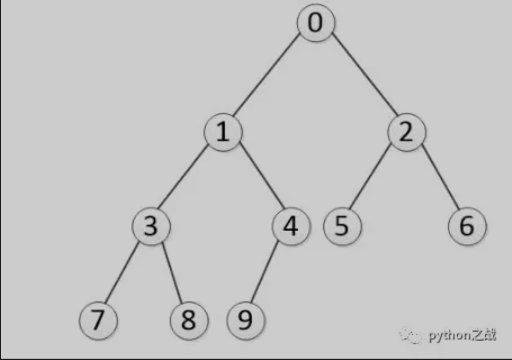

# python实现二叉树数据结构的多种遍历方式
二叉树的遍历比较有意思，首先是遍历的方式比较多，大的来说分为深度遍历和广度遍历，
深度遍历又分为先序遍历/中序遍历/后序遍历，其中深度遍历用递归来实现，广度遍历用队列来实现。<br>
深度遍历和广度遍历是相对的概念，深度遍历是沿着树的深度遍历树的节点，尽可能深的搜索树的分支；
广度遍历是从树的根层级开始一层一层的遍历，遍历完上一层再遍历下一层；如下：<br>

>> 深度遍历顺序：0-1-3-7-8-4-9-2-5-6（先序遍历）<br>
>> 广度遍历顺序：0-1-2-3-4-5-6-7-8-9 <br>
但对于深度遍历而言还有三种方式：先序遍历/中序遍历/后序遍历；先序遍历的顺序为：根节点->左子树->右子树；
中序遍历为：左子树->根节点->右子树；当然后序遍历是：左子树->右子树->根节点；其中的序指的是根节点相对于左右节点的遍历位置。<br>
>> 在上二叉树中我们按照深度遍历的三种方式得到的顺序如下：<br>
>> 先序遍历：0-1-3-7-8-4-9-2-5-6 <br>
>> 中序遍历：7-3-8-1-9-4-0-5-2-6 <br>
>> 后序遍历：7-8-3-9-4-1-5-6-2-0 <br>
>> 注意：先序遍历是从上往下看，中序遍历和后续遍历是从下往上看，从哪里开始就决定了什么相对简单二叉树的权重。<br>
##### 深度遍历的实现：<br>
```
class Node:
    """节点类"""
    def __init__(self, elem, lchild=None, rchild=None):
        self.elem = elem
        self.lchild = lchild
        self.rchild = rchild


class Tree:
    """树类"""
    def __init__(self, root=None):
        self._root = root

    def add(self, item):
        node = Node(item)
        if not self._root:
            self._root = node
            return
        queue = [self._root]
        while queue:
            cur = queue.pop(0)
            if not cur.lchild:
                cur.lchild = node
                return
            elif not cur.rchild:
                cur.rchild = node
                return
            else:
                queue.append(cur.rchild)
                queue.append(cur.lchild)

    def preorder(self, root):
        """
        先序遍历-递归实现
        :param root:
        :return:
        """
        if not root:
            raise ValueError("ROOT ERROR")
        print(root.elem)
        self.preorder(root.lchild)
        self.preorder(root.rchild)

    def inorder(self, root):
        """
        中序遍历-递归实现
        :param root:
        :return:
        """
        if not root:
            raise ValueError("ROOT ERROR")
        self.inorder(root.lchild)
        print(root.elem)
        self.inorder(root.rchild)

    def postorder(self, root):
        """
        后序遍历-递归实现
        :param root: 
        :return: 
        """
        if not root:
            raise ValueError("ROOT ERROR")
        self.postorder(root.lchild)
        self.postorder(root.rchild)
        print(root.elem)
```
##### 广度遍历的实现；
```
class Node:
    """节点类"""
    def __init__(self, elem, lchild=None, rchild=None):
        self.elem = elem
        self.lchild = lchild
        self.rchild = rchild


class Tree:
    """树类"""
    def __init__(self, root=None):
        self._root = root

    def breadth_travel(self, root):
        """
        广度优先-队列实现
        :param root:
        :return:
        """
        if not root:
            raise ValueError("ROOT ERROR")
        queue = [root]
        while queue:
            node = queue.pop(0)
            print(node.elem)
            if node.lchild:
                queue.append(node.lchild)
            elif node.rchild:
                queue.append(node.rchild)
```
递归函数使得二叉树的遍历操作更加的简洁，上面的深度遍历的三种方式除了递归以外，还可以使用堆栈的结构来实现，如果感兴趣可自行实现。<br>
