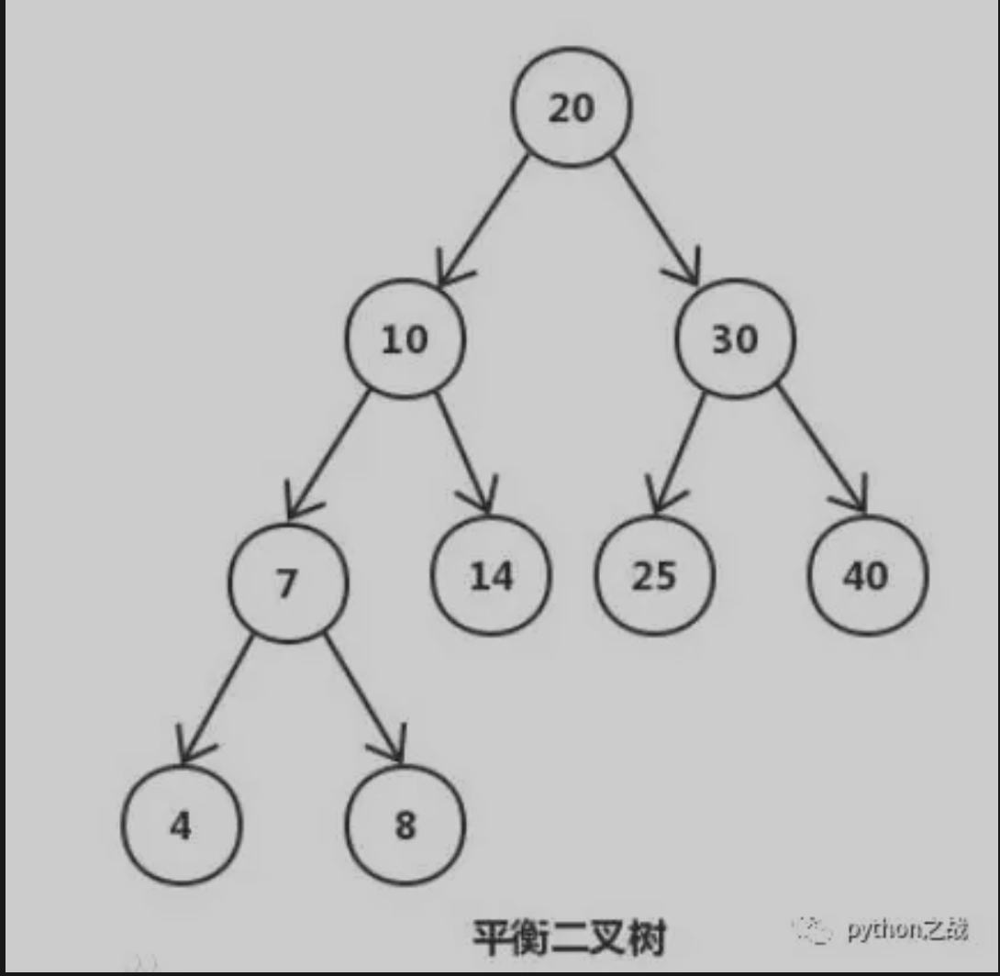
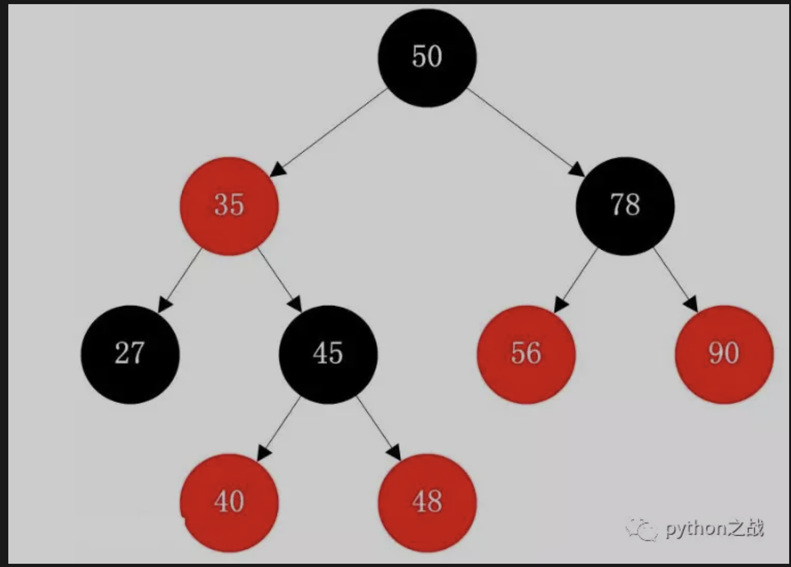
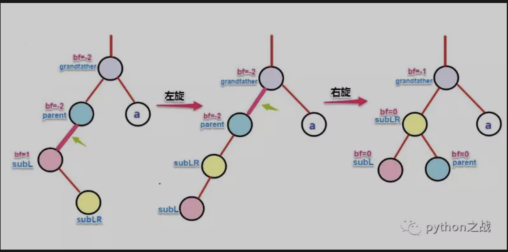
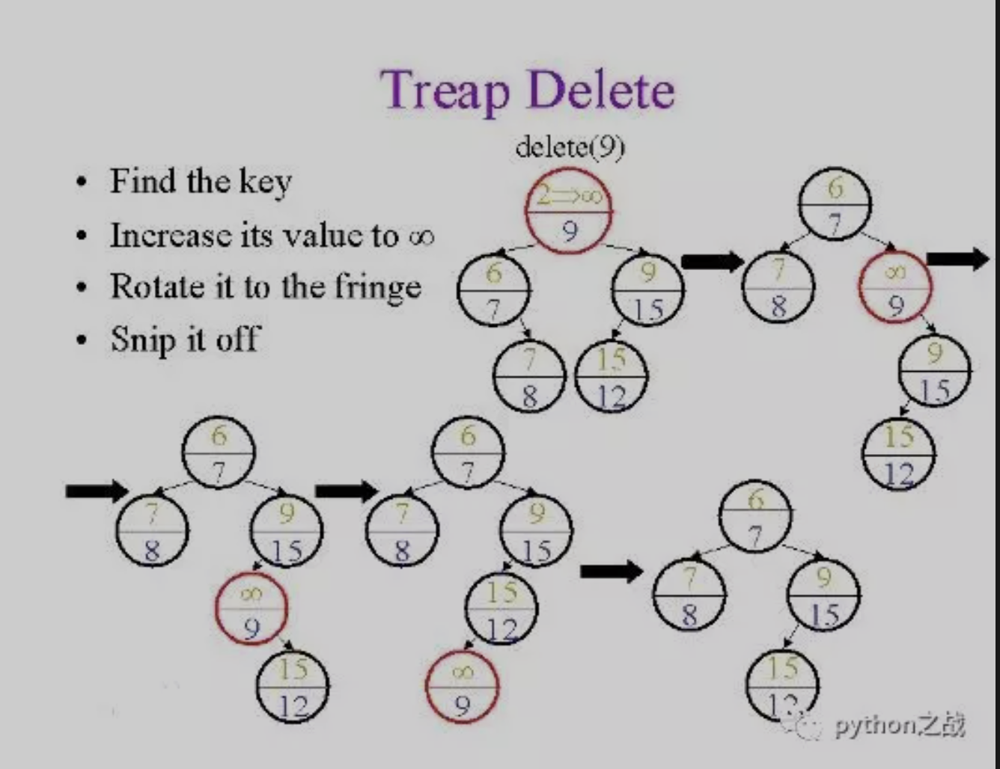
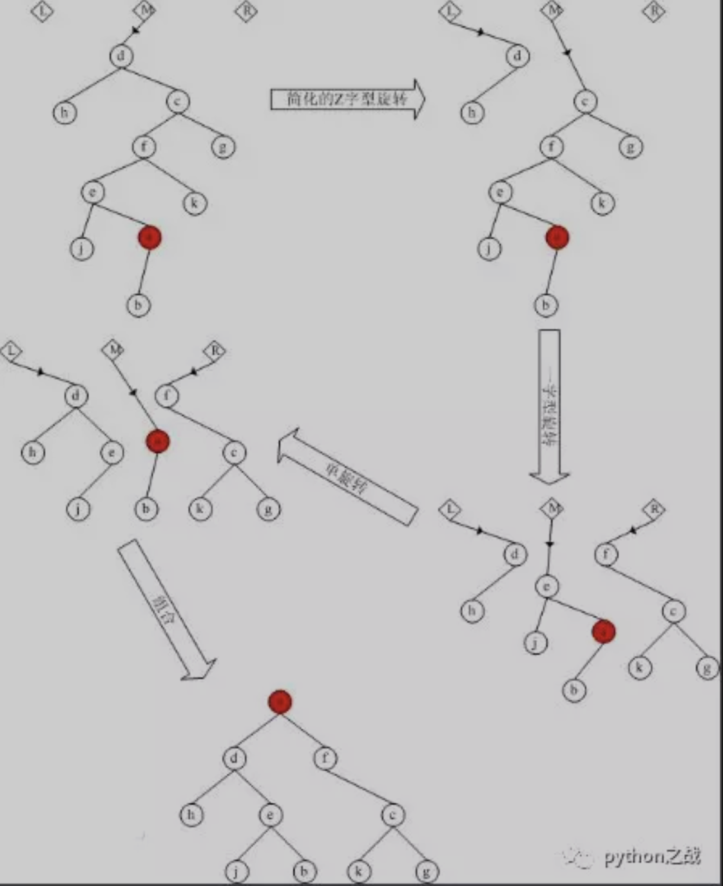

# 平衡二叉树简介
平衡二叉搜索树（Self-balancing binary search tree）又被称为AVL树（有别于AVL算法），且具有以下性质：
它是一 棵空树或它的左右两个子树的高度差的绝对值不超过1，并且左右两个子树都是一棵平衡二叉树。 
平衡二叉树的常用实现方法有红黑树、AVL、替罪羊树、Treap、伸展树等。  最小二叉平衡树的节点总数的公式如下 
F(n)=F(n-1)+F(n-2)+1 这个类似于一个递归的数列，可以参考Fibonacci(斐波那契)数列，
1是根节点，F(n-1)是左子树的节点数量，F(n-2)是右子树的节点数量。 

平衡二叉树主要使用在数据的搜索查询中，二叉树支持动态的插入和查找，保证操作在O(height)时间，
平衡二叉树的相关实现算法的应用： 
AVL树:最早的平衡二叉树之一。应用相对其他数据结构比较少。windows对进程地址空间的管理用到了AVL树 
红黑树:平衡二叉树，广泛用在C++的STL中。map和set都是用红黑树实现的。
我们熟悉的STL的map容器底层是RBtree,当然指的不是unordered_map,后者是hash。
B/B+树用在磁盘文件组织 数据索引和数据库索引
Trie树 字典树，用在统计和排序大量字符串 
##### 几种平衡二叉树实现算法的简介：
红黑树是一种自平衡二叉查找树，是在计算机科学中用到的一种数据结构，典型的用途是实现关联数组。
它是在1972年由Rudolf Bayer发明的，他称之为"对称二叉B树"，它现代的名字是在 Leo J. Guibas 和 
Robert Sedgewick 于1978年写的一篇论文中获得的。它是复杂的，但它的操作有着良好的最坏情况运行时间，
并且在实践中是高效的: 它可以在O(log n)时间内做查找，插入和删除，这里的n是树中元素的数目。 

AVL是最先发明的自平衡二叉查找树算法。在AVL中任何节点的两个儿子子树的高度最大差别为一，
所以它也被称为高度平衡树，n个结点的AVL树最大深度约1.44log2n。 
查找、插入和删除在平均和最坏情况下都是O（log n）。增加和删除可能需要通过一次或多次树旋转来重新平衡这个树。 

Treap是一棵二叉排序树，它的左子树和右子树分别是一个Treap，和一般的二叉排序树不同的是，
Treap纪录一个额外的数据，就是优先级。 
Treap在以关键码构成二叉排序树的同时，还满足堆的性质(在这里我们假设节点的优先级大于该节点的孩子的优先级)。
但是这里要注意的是Treap和二叉堆有一点不同，就是二叉堆必须是完全二叉树，而Treap并不一定是。 

伸展树（Splay Tree）是一种二叉排序树，它能在O(log n)内完成插入、查找和删除操作。
它由Daniel Sleator和Robert Tarjan创造。它的优势在于不需要记录用于平衡树的冗余信息。
在伸展树上的一般操作都基于伸展操作。 

Size Balanced Tree（简称SBT）是一自平衡二叉查找树，是在计算机科学中用到的一种数据结构。
它是由中国广东中山纪念中学的陈启峰发明的。 
陈启峰于2006年底完成论文《Size Balanced Tree》，并在2007年的全国青少年信息学奥林匹克竞赛冬令营中发表。
由于SBT的拼写很容易找到中文谐音，它常被中国的信息学竞赛选手和ACM/ICPC选手们戏称为“傻B树”、“Super BT”等。 
相比红黑树、AVL树等自平衡二叉查找树，SBT更易于实现。据陈启峰在论文中称，SBT是“目前为止速度最快的高级二叉搜索树”。
SBT能在O(log n)的时间内完成所有二叉搜索树（BST）的相关操作，而与普通二叉搜索树相比，
SBT仅仅加入了简洁的核心操作Maintain。 
由于SBT赖以保持平衡的是size域而不是其他“无用”的域，它可以很方便地实现动态顺序统计中的select和rank操作。 
平衡二叉树的实现比较复杂，这篇文章就当科普一下平衡二叉树的概念，向往算法工程师发展的可以继续深入。 

