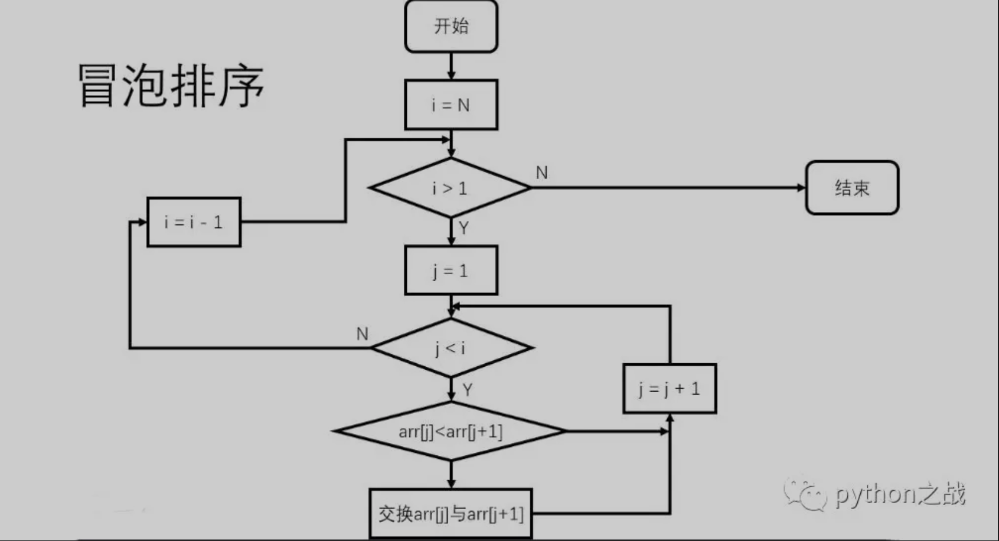
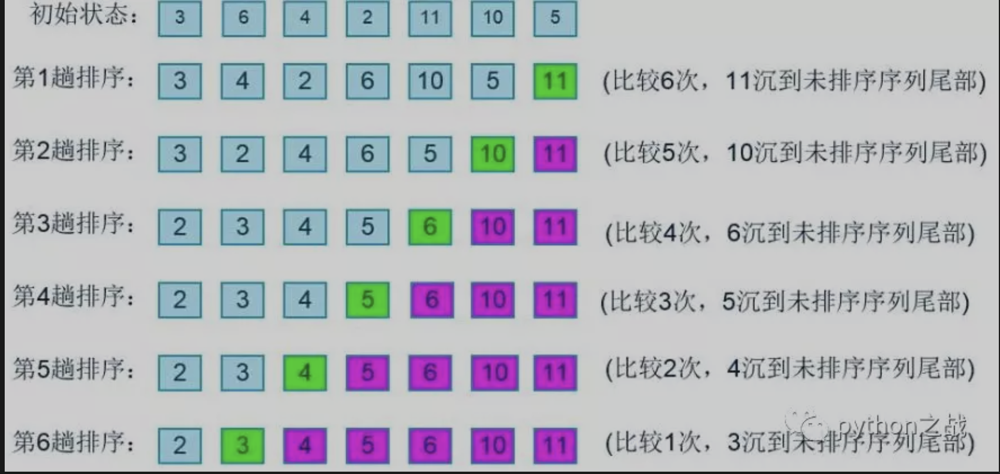

# python实现冒泡排序算法
冒泡排序，一个经典的排序算法，因在算法运行中，极值会像水底的气泡一样逐渐冒出来，因此而得名。<br>
冒泡排序的过程是比较两个相邻元素的大小，然后根据大小交换位置，这样从列表左端开始冒泡，
最后最大值会依次从右端冒出。<br>

##### python实现冒泡排序：
```
def bubble_sort(nums):
    for i in range(len(nums) - 1):
        for j in range(len(nums) - i - 1):
            if nums[j] > nums[j + 1]:
                nums[j], nums[j + 1] = nums[j + 1], nums[j]
    return nums
```
python实现冒泡排序的核心思想是通过从列表一端迭代循环元素，再通过一个循环让这个元素之后的元素相邻两个比较，
从而依次将最大值移动到最末端，如下图示意。<br>

本想放gif图的，放不上有点问题。<br>
关于冒泡排序的时间复杂度，在上面python实现的代码中时间复杂度是 ，
当然可以再考虑一下极端的情况：当队列已经从小到大排好序或者从大到小排好序，从小到大排好顺序时可以只扫描一遍就结束排序，
此时时间复杂度为O(n)，如果是从大到小，那么就需要扫描n-1次，同时需要比较交换n-1次，时间复杂度为 。<br>

