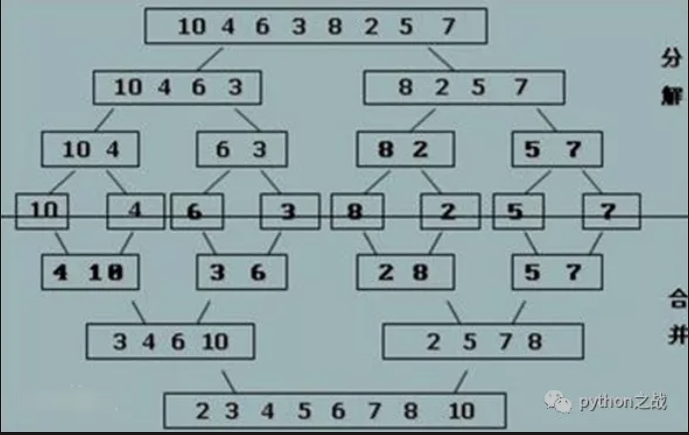

# python实现归并算法
归并排序是采用分治法的一个非常典型的应用，另一个可以采用分治法的是快速排序，归并算法比快速排序速度稍低。
归并排序的思想就是先递归分解数组，再合并数组。<br>
将数组分解最小之后，然后合并两个有序数组，基本思路是比较两个数组的最前面的数，谁小就先取谁，取了后相应的指针就往后移一位。
然后再比较，直至一个数组为空，最后把另一个数组的剩余部分复制过来即可。<br>
###### >> 如设有数列{6，202，100，301，38，8，1} <br>
>> 初始状态：6,202,100,301,38,8,1 <br>
>> 第一次归并后：{6,202},{100,301},{8,38},{1}，比较次数：3；<br>
>> 第二次归并后：{6,100,202,301}，{1,8,38}，比较次数：4；<br>
>> 第三次归并后：{1,6,8,38,100,202,301},比较次数：4；<br>
>> 总的比较次数为：3+4+4=11；<br>
>> 逆序数为14；<br>
##### python实现：
```
def merge_sort(alist):
    """
    递归分治序列
    :param alist:
    :return:
    """
    if len(alist) <= 1:
        return alist
    num = len(alist)//2
    left = merge_sort(alist[:num])
    right = merge_sort(alist[num:])
    return merge(left, right)  # 合并


def merge(left, right):
    """
    合并操作
    :param left:
    :param right:
    :return:
    """

    l, r = 0, 0
    result = []
    while l < len(left) and r < len(right):
        if left[l] < right[r]:  # 筛选排序将left与right最小元素按序加入新序列
            result.append(left[l])
            l += 1
        else:
            result.append(right[r])
            r += 1
    result += left[l:]
    result += right[r:]
    return result
```
