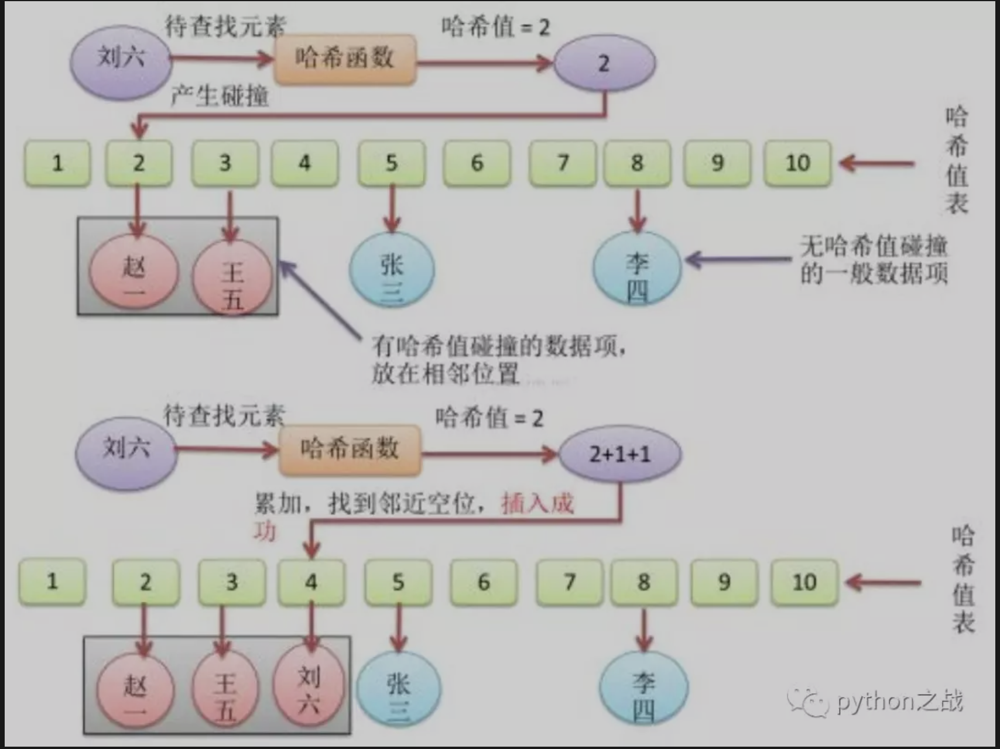

# python实现顺序查找和哈希查找算法
顺序查找 <br>
顺序查找是按照序列原有顺序对数组进行遍历比较查询的基本查找算法，顺序查找是最简单的搜索算法，其实现如下：<br>
```
def sequential_search(items, item):
    for i in items:
        if i == item:
            return i
    else:
        return False
```
适用于线性表的顺序存储结构和链式存储结构,该算法的时间复杂度为O(n)。<br>
缺点：是当n 很大时，平均查找长度较大，效率低；<br>
优点：是对表中数据元素的存储没有要求。另外，对于线性链表，只能进行顺序查找。<br>
##### 哈希查找算法
哈希查找算法，依赖哈希表这种数据结构，它是以键值对的形式存储数据，对于哈希查找算法来说，
其时间复杂度为O(1),Redis数据表中也有哈希存储，储存形式是键值对。<br>
##### python实现哈希数据结构及其哈希查找算法
```
class HashTable:
    def __init__(self, size):
        self.elem = [None for i in range(size)]  # 使用list数据结构作为哈希表元素保存方法
        self.count = size  # 最大表长

    def hash(self, key):
        return key % self.count  # 散列函数采用除留余数法

    def insert_hash(self, key):
        """插入关键字到哈希表内"""
        address = self.hash(key)  # 求散列地址
        while self.elem[address]:  # 当前位置已经有数据了，发生冲突。
            address = (address + 1) % self.count  # 线性探测下一地址是否可用
        self.elem[address] = key  # 没有冲突则直接保存。

    def search_hash(self, key):
        """查找关键字，返回布尔值"""
        star = address = self.hash(key)
        while self.elem[address] != key:
            address = (address + 1) % self.count
            if not self.elem[address] or address == star:  # 说明没找到或者循环到了开始的位置
                return False
        return True
```
哈希查找的产生有这样一种背景——有些数据本身是无法排序的(如图像)，有些数据是很难比较的(如图像)。
如果数据本身是无法排序的，就不能对它们进行比较查找。<br>
如果数据是很难比较的，即使采用折半查找，要比较的次数也是非常多的。因此，哈希查找并不查找数据本身，
而是先将数据映射为一个整数(它的哈希值)，并将哈希值相同的数据存放在同一个位置一即以哈希值为索引构造一个数组。<br>
在哈希查找的过程中，只需先将要查找的数据映射为它的哈希值，然后查找具有这个哈希值的数据，这就大大减少了查找次数。<br>
如果构造哈希函数的参数经过精心设计，内存空间也足以存放哈希表，查找一个数据元素所需的比较次数基本上就接近于一次。<br>
